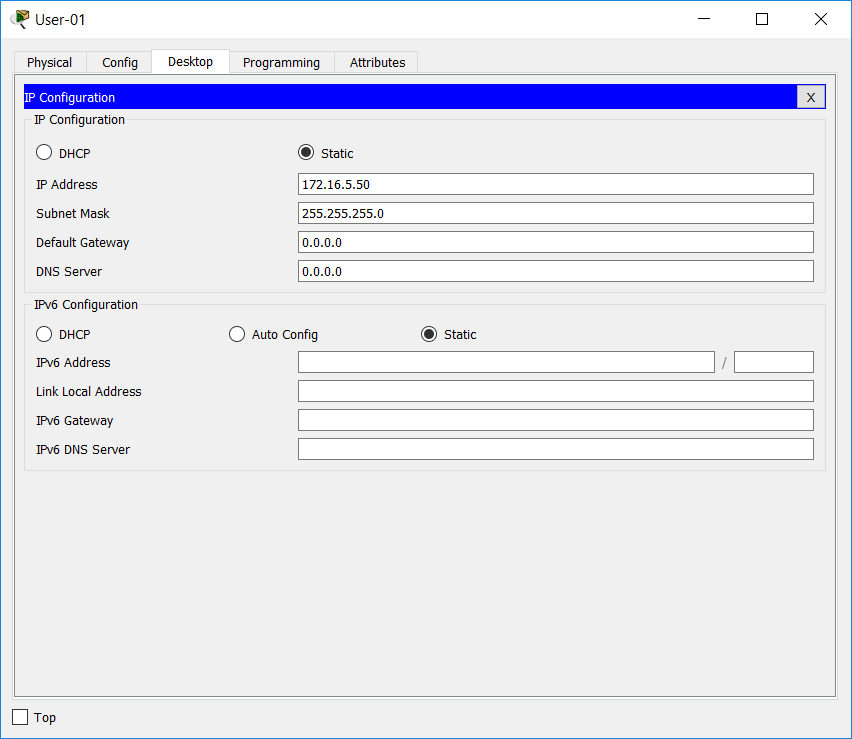

# Documentatie Lab 1 Packet Tracer: Basisconfiguratie switch

### Belangrijke gegevens
* vty line 0 15 password: `8ubRu`
* console line password: `8ubRu`
* enable secret: `C9WrE`

| Device  | Interface | IP Address   | Subnet Mask   |
| :---    |    ---:   |         ---: |        ---:   |
| Asw-1   | VLAN1     | 172.16.5.35  | 255.255.255.0 |
| Asw-2   | VLAN1     | 172.16.5.40  | 255.255.255.0 |
| User-01 | NIC       | 172.16.5.50  | 255.255.255.0 |
| User-02 | NIC       | 172.16.5.60  | 255.255.255.0 |

## Stap 1: Switch verbinden met desktop
* Maak gebruik van een `console cable`, plug deze in in de desktop poort `rs232` en op de switch in poort `console`
* Start de configuratie van de switch vanop de desktop > Terminal

## Stap 2: Initiële configuratie van de switches
### Hostname aanpassen

* switch> `enable`
* switch# `configure terminal`
* switch(config)# `hostname ASw-1`

### Password instellen
* ASw-1(config)# `line vty 0 15`
* ASw-1(config-line)# `password 8ubRu`
* ASw-1(config-line)# `exit`
* ASw-1(config)# `line console 0`
* ASw-1(config-line)# `password 8ubRu`

### Configuratie tot zover nagaan
* ASw-1# `show running-configuration`

### Passwords encrypteren en nakijken
* ASw-1(config)# `service password-encryption`
* ASw-1# `show running-configuration`

### Warning message instellen
* ASw-1(config)# `banner motd #warning, keep out unless you have authorisation to enter#`

### interface IP Address toekennen 
* ASw-1(config)# `interface vlan 1`
* ASw-1(config-if)# `ip address 172.16.5.35 255.255.255.0`
* ASw-1(config-if)# `no shutdown`

### Running configuration opslaan 
* ASw-1# `copy running-config startup-config`

Doorloop dezelfde stappen nu ook voor de andere switch!

## Stap 3: IP Addresses toekennen aan de desktop's

* We maken gebruik van de tools geinstalleerd op de desktop's en vullen de IP Addresses in zoals in onderstaande schermafbeelding:

### User-01 Desktop

- PC HERSTARTEN!

### User-02 Desktop

- PC HERSTARTEN!
