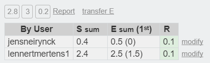

# Lastenboek Taak 1: Packet Tracer Switch Basisconfiguratie

* Verantwoordelijke uitvoering: `Lennert Mertens`
* Verantwoordelijke testen: `Jens Neirynck`

## Deliverables

* Werkende switches
* Goed geconfigureerde wachtwoorden, boodschappen, ip addresses
* Pingen over het netwerk moet mogelijk zijn
* Desktop's werden juist ingesteld
* Documentatie
* Packet Tracer bestand

## Deeltaken

* Switch 1 configureren: hostname, enable secret, banner, ip address, configuratie opslaan
* Switch 2 configureren: hostname, enable secret, banner, ip address, configuratie opslaan
* Desktop 1 ip address toekennen
* Desktop 2 ip address toekennen
* Volledige configuratie testen en pingen over het netwerk

## Tijdbesteding

| Student                                             | Geschat | Gerealiseerd |
| :---                                                |    ---: |         ---: |
| [LennertMertens](https://github.com/LennertMertens) | 2.5     |        2.4   |
| Jens Neirynck                                       | 0.5     |         0.4  |

