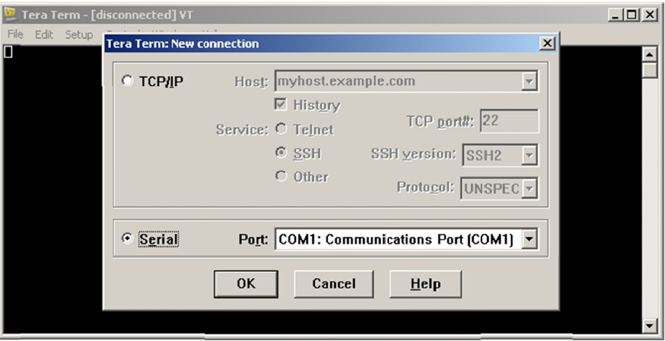
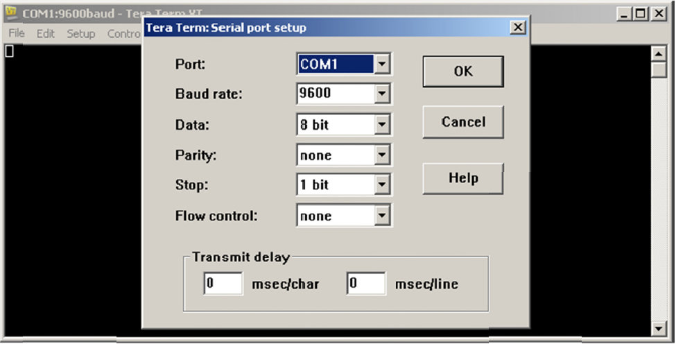
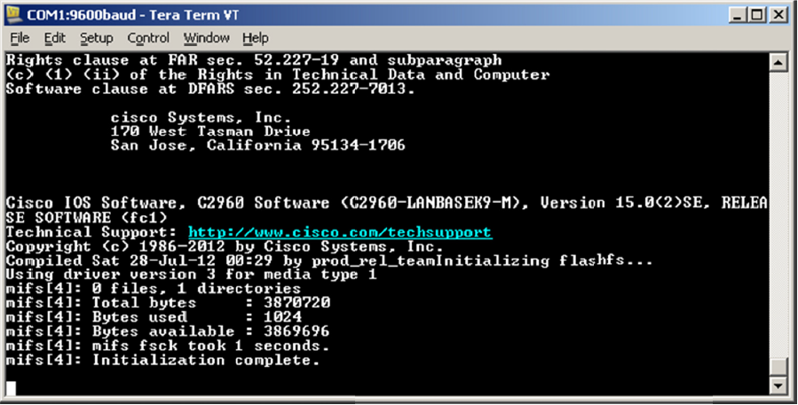

# Documentatie Lab 1: Establishing a Console Session with Tera Term

### Benodigdheden
* Cisco 2960 switch
* Cisco router 1941
* 1 PC with terminal emulation program
* Power cable
* Rollover console cable (DB9 to RJ45)
* Eventueel USB to DB9 adapter

### Switch terugzetten naar fabrieksinstellingen
* Switch> `enable`
* Switch# `write erase`
* Switch# `delete flash:vlan.dat` -> Confirm
* Switch# `reload` -> Save configuration? NO

## Deel 1: Acces een Cisco switch door de Serial Console Port
### Stap 1: Desktop verbinden met Switch via een rollover console cable
* Maak gebruik van een ` rollover console cable`, plug deze in in de desktop poort `rs232` (COM poort) of in de `USB` poort aan de hand van
een `USB to DB9` en op de switch in poort `console`
* Start de configuratie vanuit een Terminal Emulation Program (vb. Tera Term)

### Stap 2: Configureer Tera Term om een console sessie op te zetten met de switch

* Installeer Tera Term (http://logmett.com/index.php?/download/free-downloads.html)
* Start Tera Term 
* In de `New Connection dialog box` selecteer je `Serial` en verifiëer je dat de COM poort geselecteerd is, klik dan `OK` om verder te gaan

* Configureer Tera Term met volgende gegevens

* Wanneer je volgende terminal uitvoer ziet kan de Cisco switch geconfigureerd worden

## Deel 2: Weergeef en configureer de Basic Device Settings
### Stap 1: Weergeef de switch IOS image version

* Switch> `show version`

### Stap 2: Configureer de clock

De klok bekijken: Switch> `show clock`

De klok instellen: Switch# `clock set 14:07:00 21 Feb 2018`

## Deel 3: (optioneel) Acces een Cisco router door gebruik te make van een Mini-USB Console Cable

### Stap 1: Fysieke connectie maken met een mini-USB cable

* Connecteer de `mini-USB cable` met de `mini-USB port` van de router
* Connecteer het andere uiteinde van de cable met een USB poort op de computer
* Zet de computer en router aan als dit nog niet het geval is

### Stap 2: Ga na of de USB console klaar is

Als je een Windows-based PC gebruikt en de LED indicator (labeled EN) van de USB console poort wordt niet groen, installeer dan de Cisco USB console driver.

De driver kan worden gevonden op (www.cisco.com) met het gerelateerde Cisco IOS device.
Volledige link naar de driver (https://software.cisco.com/download/release.html?mdfid=282774238&flowid=714&softwareid=282855122&release=3.1&relind=AVAILABLE&rellifecycle=&reltype=latest)
(Let wel, de PC moet eropgestart worden na installatie)

