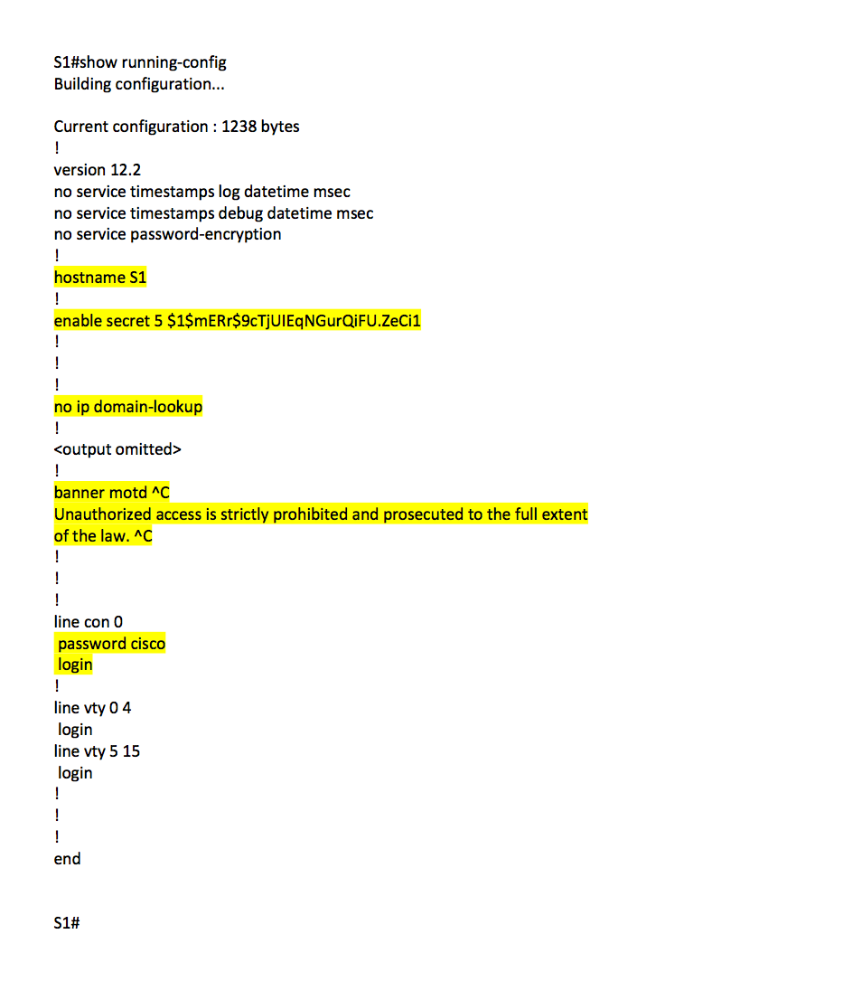
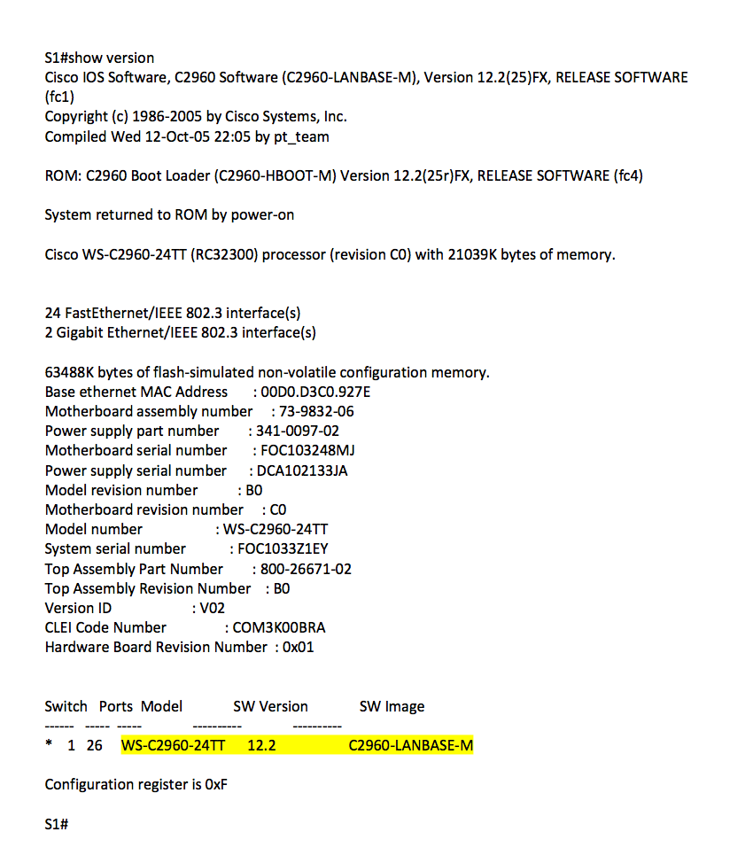
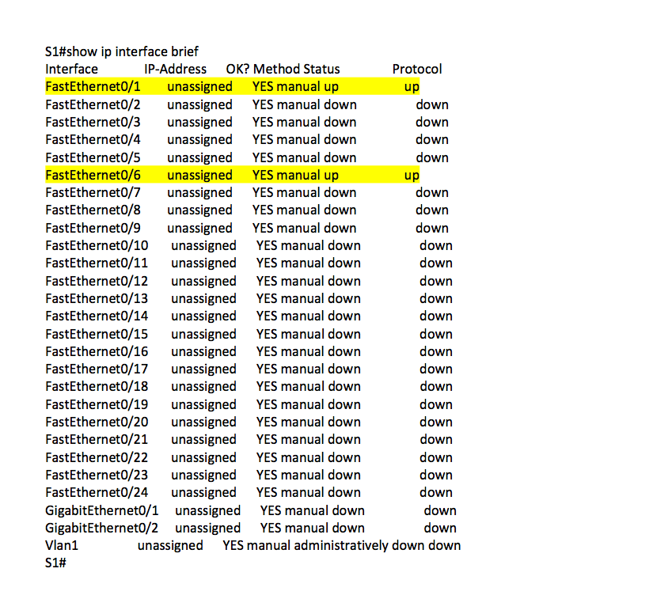
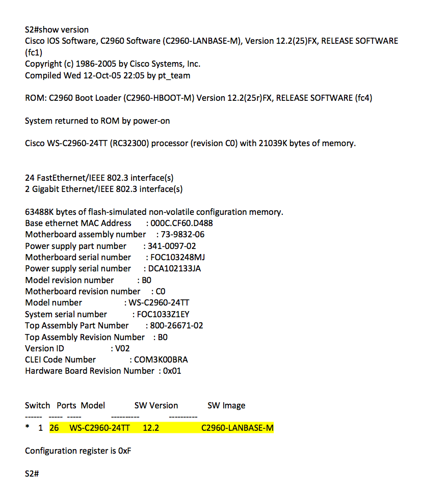

# Testplan taak 1: lab2-Building A Simple Network

## Alle te testen onderdelen in secties onderverdeeld: 

### PC configuratie

- [ ] Controleer of PC-A draait.
	(Groen lichtje op NIC en desktop is bereikbaar)
- [ ] Controleer of PC-B draait.
	(Groen lichtje op NIC en desktop is bereikbaar)
- [ ] Ping vanaf PC-A naar PC-B met ip 192.168.1.11
	(Je krijgt ten minste 1 reply)
- [ ] Ping vanaf PC-B naar PC-A met ip 192.168.1.10
	(Je krijgt ten minste 1 reply)

=> Als bovenstaande geslaagd zijn dan werkt de configuratie van de hots naar behoren.

### S1 configuratie

- [ ] Open de CLI van de switch
- [ ] Controleer ofdat je de Message Off The Day ziet
	(Unauthorized access is strictly prohibited and prosecuted to the full extent
of the law.)
- [ ] Druk op enter en voer als wachtwoord cisco in.
	(Je wordt ingelogd)
- [ ] Type enable en voer als wachtwoord class in.
	(Je wordt ingelogd)
- [ ] Voer het commando "show running-config" uit.
	(Controlleer volgens Figuur1)
- [ ] Voer het commando "show version" uit.
	(Controlleer volgens Figuur2)
- [ ] Voer het commando "Show ip interface brief" uit.
	(Controlleer volgens Figuur3)

=> Als bovenstaande geslaagd zijn dan werkt de configuratie van Switch1 naar behoren.

### S2 configuratie

- [ ] Open de CLI van de switch
- [ ] Controleer ofdat je de Message Off The Day ziet
	(Unauthorized access is strictly prohibited and prosecuted to the full extent
of the law.)
- [ ] Druk op enter en voer als wachtwoord cisco in.
	(Je wordt ingelogd)
- [ ] Type enable en voer als wachtwoord class in.
	(Je wordt ingelogd)
- [ ] Voer het commando "show running-config" uit.
	(Controlleer volgens Figuur4)
- [ ] Voer het commando "show version" uit.
	(Controlleer volgens Figuur5)
- [ ] Voer het commando "Show ip interface brief" uit.
	(Controlleer volgens Figuur6)

=> Als bovenstaande geslaagd zijn dan werkt de configuratie van Switch1 naar behoren.

## CLI-Bestanden

###### Figuur1

###### Figuur2

###### Figuur3

###### Figuur4

###### Figuur5

###### Figuur6

Auteur(s) testplan: Kenzie Coddens
