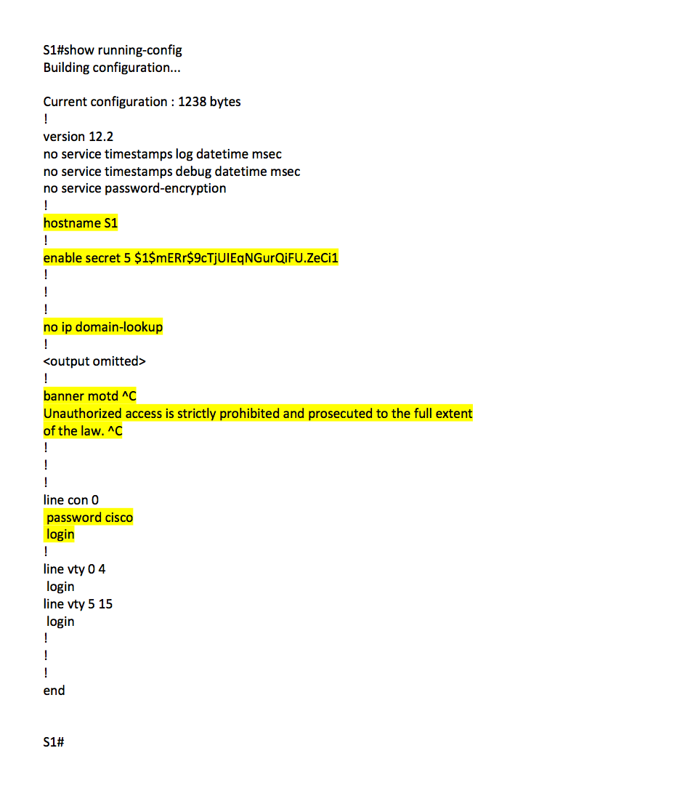
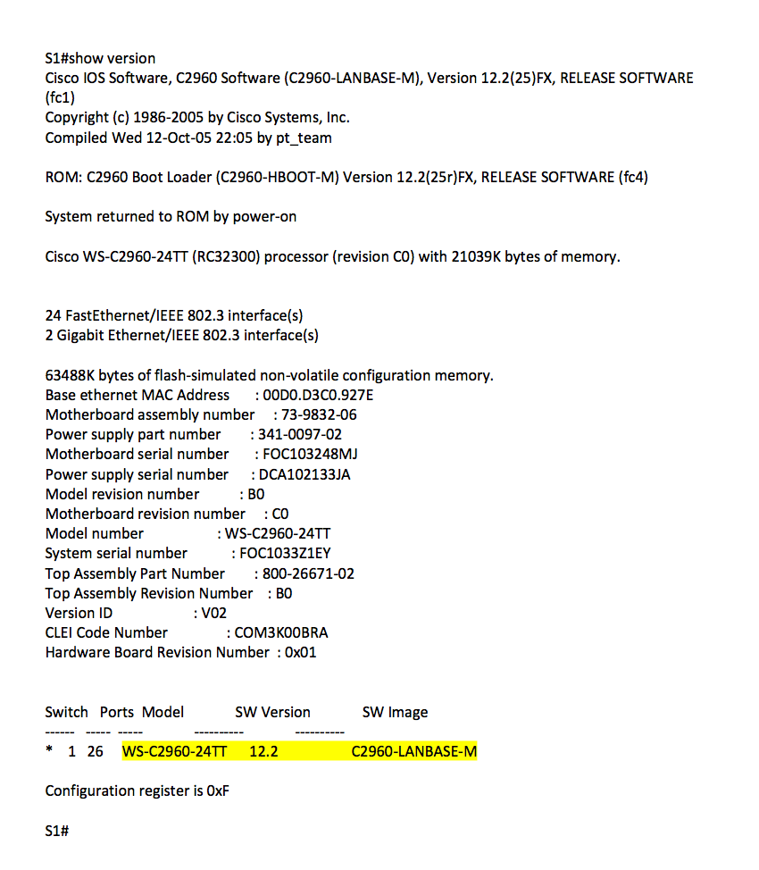
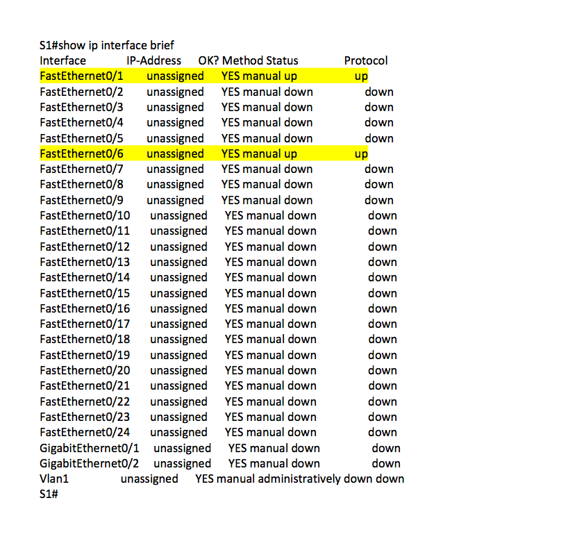
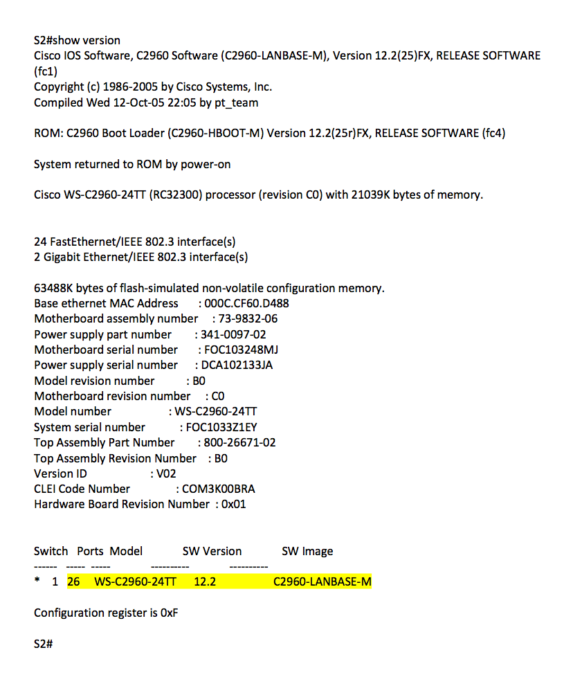
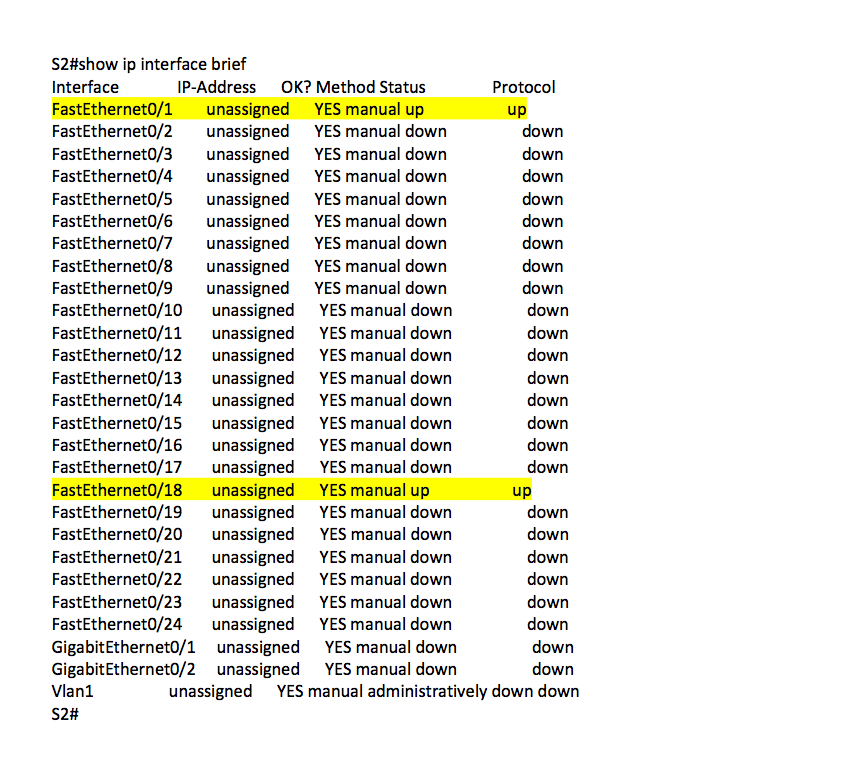

# Testrapport lab 2: Building A Simple Network
## Alle te testen onderdelen in secties onderverdeeld: 

### PC configuratie

- [x] Controleer of PC-A draait.
	(Groen lichtje op NIC en desktop is bereikbaar)
- [x] Controleer of PC-B draait.
	(Groen lichtje op NIC en desktop is bereikbaar)
- [x] Ping vanaf PC-A naar PC-B met ip 192.168.1.11
	(Je krijgt ten minste 1 reply)
- [x] Ping vanaf PC-B naar PC-A met ip 192.168.1.10
	(Je krijgt ten minste 1 reply)

Alle bovenstaande testen werden succesvol uitgevoerd dus de switches en computers werken naar behoren.

### S1 configuratie

- [x] Open de CLI van de switch
- [x] Controleer of je de Message Off The Day ziet
	(Unauthorized access is strictly prohibited and prosecuted to the full extent
of the law.)
- [x] Druk op enter en voer als wachtwoord cisco in.
	(Je wordt ingelogd)
- [x] Type enable en voer als wachtwoord class in.
	(Je wordt ingelogd)
- [x] Voer het commando "show running-config" uit.
	(Controlleer volgens Figuur1)
- [x] Voer het commando "show version" uit.
	(Controlleer volgens Figuur2)
- [x] Voer het commando "Show ip interface brief" uit.
	(Controlleer volgens Figuur3)

Alle bovenstaande testen werden succesvol uitgevoerd dus switch 1 werkt naar behoren.

### S2 configuratie

- [x] Open de CLI van de switch
- [x] Controleer ofdat je de Message Off The Day ziet
	(Unauthorized access is strictly prohibited and prosecuted to the full extent
of the law.)
- [x] Druk op enter en voer als wachtwoord cisco in.
	(Je wordt ingelogd)
- [x] Type enable en voer als wachtwoord class in.
	(Je wordt ingelogd)
- [x] Voer het commando "show running-config" uit.
	(Controlleer volgens Figuur4)
- [x] Voer het commando "show version" uit.
	(Controlleer volgens Figuur5)
- [x] Voer het commando "Show ip interface brief" uit.
	(Controlleer volgens Figuur6)

Alle bovenstaande testen werden succesvol uitgevoerd dus switch 2 werkt naar behoren.

## CLI-Bestanden

###### Figuur1

###### Figuur2

###### Figuur3

###### Figuur4

###### Figuur5

###### Figuur6

Auteur(s) testplan: Kenzie Coddens
Uitvoerder(s) test: Lennert Mertens
Uitgevoerd op: 23/02/2018
Github commit:  COMMIT HASH
