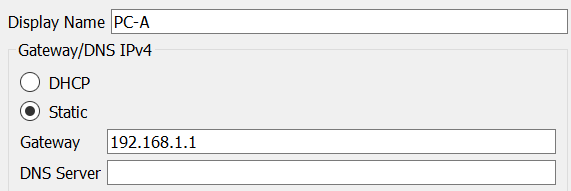
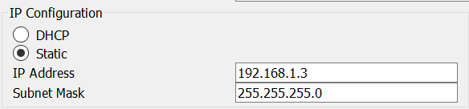
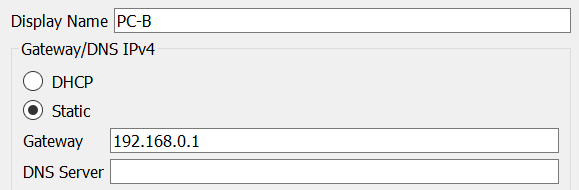
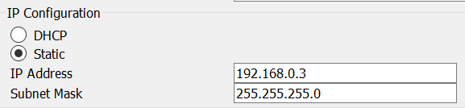
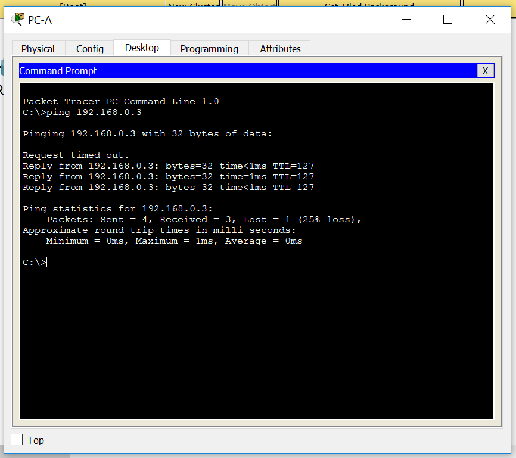
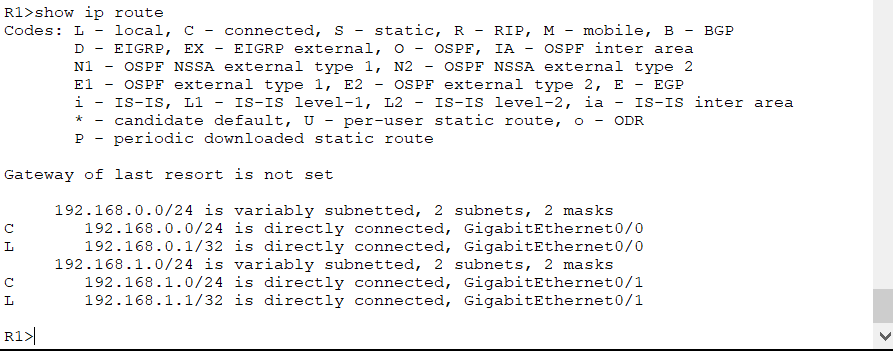
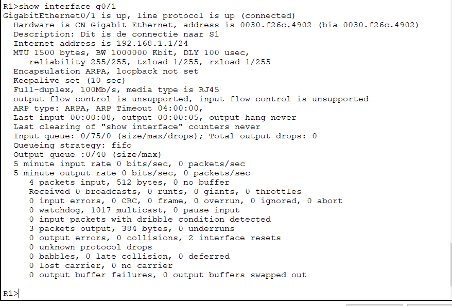
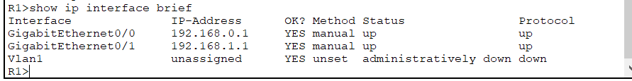
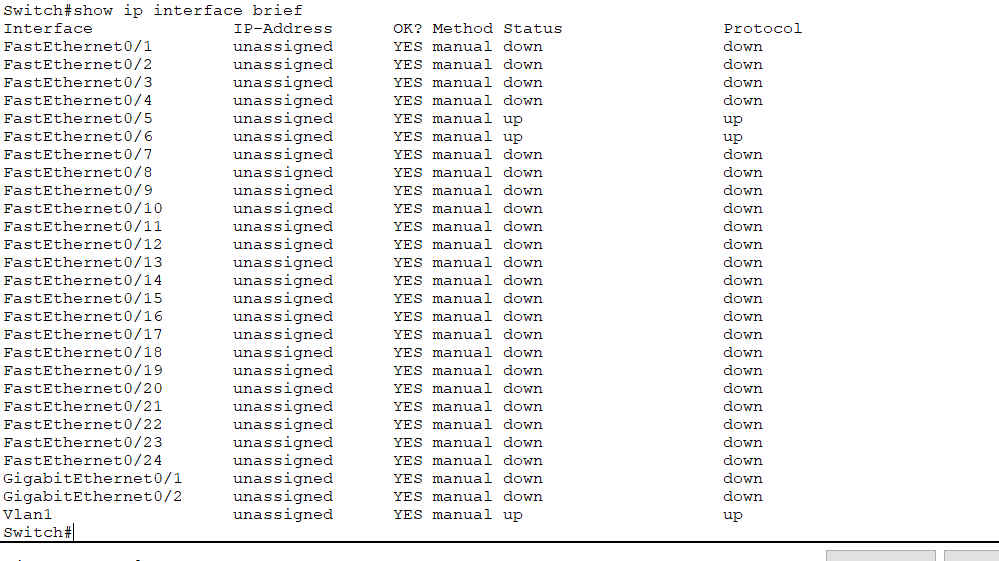

# Documentatie Lab 3: Building a switch and router network

### Belangrijke gegevens
* console line password: `cisco`
* enable secret: `class`

| Device  | Interface | IP Address   | Subnet Mask   | Default Gateway |
| :---    |    ---:   |         ---: |        ---:   |         ---:    |
| R1      | G0/0      | 192.168.0.1  | 255.255.255.0 | N/A             |
|         | G0/1      | 192.168.1.1  | 255.255.255.0 | N/A             |
| S1      | VLAN 1    | N/A          | N/A           | N/A             |
| PC-A    | NIC       | 192.168.1.3  | 255.255.255.0 | 192.168.1.1     |
| PC-B    | NIC       | 192.168.0.3  | 255.255.255.0 | 192.168.1.1     |

### Benodigdheden
* Cisco 2960 switch
* Cisco router 1941
* 2 PCs with terminal emulation program
* Rollover console cable (DB9 to RJ45)
* Ethernet cables

## Deel 1: Set up the topology and initialize devices
### Stap 1: Set up equipment to match the network topology.
### Stap 2: Initialize and restart the router and switch.
  * Zie packet tracer bestand

## Deel 2: Configure Devices and Verify Connectivity
### stap 1: Assign static IP information to the PC interfaces.
  ### a. Configure the IP address, subnet mask, and default gateway settings on PC-A
  * PC-A
  
  
  
  ### b. Configure the IP address, subnet mask, and default gateway settings on PC-B
  * PC-B
  
  
  
### stap 2: Configure the router.
  ### a. Console into the router and enable priviliged EXEC mode.
  * Router> `enable`
  ### b. Enter configuration mode
  * Router# `conf t`
  ### c. Assign a device name to the router.
  * Router(config)# `hostname R1`
  ### d. Disable DNS lookup to prevent the router from attempting to translate incorrectly entered commands as though they were host names.
  * R1(config)# `no ip domain-lookup`
  ### e. Assign class as the priviliged EXEC encrypted password.
  * R1(config)# `enable secret class`
  ### f. Assign cisco as the console password and enable login.
  * R1(config)# `line con 0`
  * R1(config-line)# `password cisco`
  * R1(config-line)# `login`
  ### g. Assign cisco as the VTY password and enable login.
  * R1(config)# `line vty 0`
  * R1(config-line)# `password cisco`
  * R1(config-line)# `login`
  ### h. Encrypt the clear text passwords.
  * R1(config)# `service password-encryption`
  ### i. Create a banner that warns anyone accessing the device that unauthorized access is prohibited.
  * R1(config)# `banner motd #Hier mogen enkel mensen met toegang, dus pas op wat je doet!#`
  ### j. Configure and activate both interfaces on the router.
  * R1(config)# `int G0/0`
  * R1(config-if)# `ip address 192.168.0.1 255.255.255.0`
  * R1(config-if)# `no shutdown`
  * R1(config-if)# `exit`
  * R1(config)# `int G0/1`
  * R1(config-if)# `ip address 192.168.1.1 255.255.255.0`
  * R1(config-if)# `no shutdown`
  * R1(config-if)# `end`
  ### k. Configure an interface description for each interface indicating which device is connected to it.
  * R1(config-line)# `int g0/0`
  * R1(config-if)# `description Dit is de connectie naar PC-B`
  * R1(config-if)# `int g0/1`
  * R1(config-if)# `description Dit is de connectie naar S1`
  * R1(config-if)# `exit`
  ### l. Save the running configuration to the startup configuration file.
  * R1# `copy running-config startup-config`
  ### m. Set the clock on the router.
  * R1# `clock set 12:34:56 12 Jan 2018`
  
  
### stap 3: Verify network connectivity.
  ### a. Ping PC-B from a command prompt window on PC-A.
  

## Deel 3: Display Device Information
### stap 1: Retrieve hardware and software information from the network devices.
  ### a. Use the show version command to answer the following questions about the router.
  * What is the name of the IOS image that the router is running?
     * Cisco IOS Software, C1900 Software (C1900-UNIVERSALK9-M), Version 15.1(4)M4
  * How much DRAM memory does the router have?
     * 524288KB
  * How much NVRAM memory does the router have?
     * 255K bytes
  * How much Flash memory does the router have?
     * 249856K bytes

    
  ### b. Use the show version command to answer the following questions about the switch.
   * What is the name of the IOS image that the switch is running?
     * Cisco IOS Software, C2960 Software (C2960-LANBASE-M), Version 12.2(25)FX, RELEASE SOFTWARE (fc1)
   * How much dynamic random access memory (DRAM) does the switch have?
     * 21039 kbytes     
   * How much nonvolatile random-access memory (NVRAM) does the switch have?
     *  Switch> ´enable´
     *  Switch#  ´dir nvram´ 
     *  238570 bytes
   * What is the model number of the switch?
     * Cisco WS-C2960-24TT
     
### stap 2: Interpretthe output from the routing table.
  ### a. Use the show ip route command on the router to answer the following questions.
   * What code is used in the routing table to indicate a directly connected network?
     * C
   * How many route entries are coded with a C code in the routing table?
     * 2
   * What interface types are associated to the C coded routes?
     * GigabitEthernet
     
     
### stap 3: Display interface information on the router.
  ### a. Use the show interface g0/1 to answer the following questions.
   * What is the operational status of the G0/1 interface?
     * up
   * What is the Media Access Control (MAC) address of the G0/1 interface?
     * 0030.f26c.4902
   * How is the Internet address displayed in this command?
     * Internet address is 192.168.1.1/24
     

### stap 4: Display a summary list of the interfaces on the router and switch.
  ### a. Enter the show ip interface brief command on the router.
   
   
  ### b. Enter the show ip interface brief command on the switch.
   
