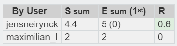

# Lastenboek Taak 1: Lab 3 - Building a Switch and Router Network

* Verantwoordelijke uitvoering: `Jens Neirynck`
* Verantwoordelijke testen: `Max Leire`

## Deliverables

* Een correct netwerktopologie opzetten en initialiseren
* Succesvolle connectie tussen de netwerkapparatuur
* Basisconfiguratie Router is correct uitgevoerd
* PC-B kan naar PC-A pingen (omgekeerd ook)
* Correct opvragen van systeeminformatie

## Deeltaken

* IP adressen toekennen aan de componenten, alsook interfaces enabelen en beschrijving aan toevoegen
* Router hernoemen
* DNS lookup uitzetten
* Wachtwoorden instellen
* Banner instellen
* Configureer de clock
* Connectie maken met een Cisco router via een Mini-USB Console Cable
* Correct met show version/show ip route/show interface kunnen werken

## Tijdbesteding

| Student         | Geschat | Gerealiseerd |
| :---            |    ---: |         ---: |
| Jens Neirynck |      5  |         4.4    |
| Max Leire  |       2 |            2 |

