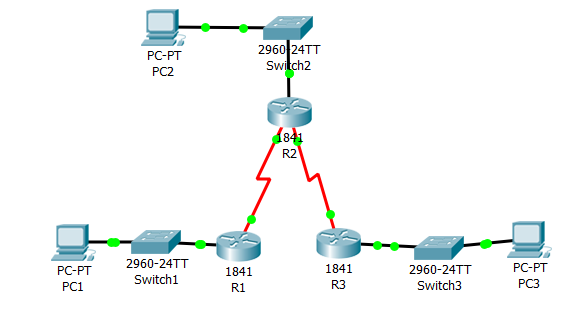
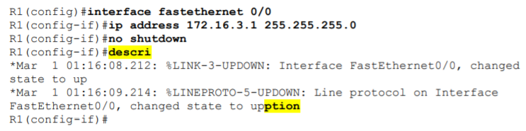
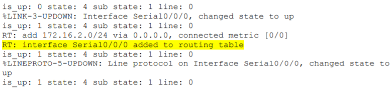
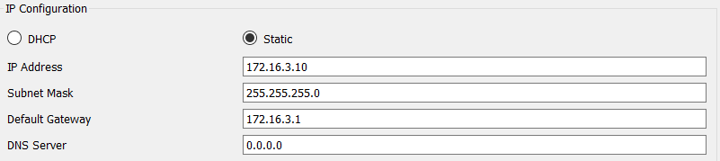
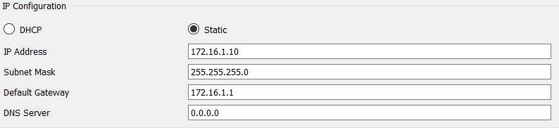
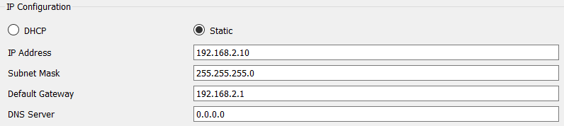
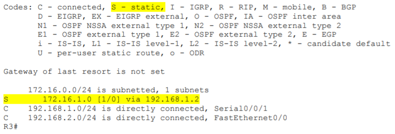
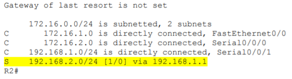
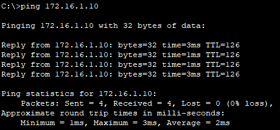
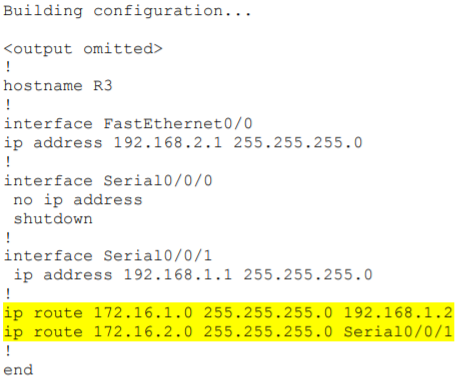

# Documentatie Lab 4: Basic Static Route Configuration

### Wachtwoorden
* User Exec password: `cisco`
* Priviliged Exec password: `class`
* Virtual lines password: `cisco`

| Device  | Interface | IP Address   | Subnet Mask   | Default Gateway |
| :---    |    ---:   |         ---: |        ---:   |         ---:    |
| R1      | Fa0/0      | 172.16.3.1  | 255.255.255.0 | N/A             |
|         | S0/0/0      | 172.16.2.1  | 255.255.255.0 | N/A             |
|R2       | Fa0/0      | 172.16.1.1  | 255.255.255.0 | N/A             |
|         | S0/0/0      | 172.16.2.2  | 255.255.255.0 | N/A             |
|         | S0/0/1      | 192.168.1.2  | 255.255.255.0 | N/A             |
|R3       | Fa0/0      | 192.168.2.1  | 255.255.255.0 | N/A             |
|         | S0/0/1     | 192.168.1.1  | 255.255.255.0 | N/A             |
| PC1      | NIC    | 172.16.3.10   | 255.255.255.0 | 172.16.3.1       |
| PC2    | NIC       | 172.16.1.10  | 255.255.255.0 | 172.16.1.1     |
| PC3    | NIC       | 192.168.2.10  | 255.255.255.0 | 192.168.2.1     |

### Benodigdheden
* 3 Routers (1841)
* 3 Switches (2960-24TT)
* 3 Pc's

## Task 1: Cable, Erase, and Reload the Routers.
### Step 1: Cable a network that is similar to the one in the Topology Diagram.

### Step 2: Clear the configuration on each router.
  
  R1> `enable`  
  R1# `erase startup-config`  
  R1# `reload`  
  R1# `no` (Op alle vragen)    
  
  Op elke router.
 
## Task 2: Perform Basic Router Configuration
### Step 1: Use global configuration commands.

R1(config)# `hostname`  
R1(config)# `no ip domain-lookup`  
R1(config)# `enable secret class`  

### Step 2: Configure the console and virtual terminal line passwords on each of the routers.

R1(config.line)# `password cisco`  
R1(config.line)# `login`  

### Step 3: Add the logging synchronous command to the console and virtual terminal lines.
R1(config)# `line console 0`  
R1(config.line)# `logging synchronous`  
R1(config.line)# `line vty 0 4`  
R1(config.line)# `logging synchronous`  

Dit belemmert IOS je keyboard input te onderbreken.  

### Step 4: Add the exec-timeout command to the console and virtual terminal lines.
R1(config)#`line console 0`  
R1(config-line)# `exec-timeout 0 0`  
R1(config-line)# `line vty 0 4`  
R1(config-line)# `exec-timeout 0 0`  

## Task 3: Interpreting Debug Output
### Step 1: On R1 from privileged EXEC mode, enter the debug ip routing command.
R1# `debug ip routing`

### Step 2: Enter interface configuration mode for R1's LAN interface.
R1# `configure terminal`  
R1(config)# `interface fastethernet 0/0`  

### Step 3: Enter the command necessary to install the route in the routing table.
R1(config-if)# `ip address 172.16.3.1 255.255.255.0`  
R1(config-if)# `no shutdown`  

### Step 4: Enter the command to verify that the new route is now in the routing table.
R1# `show ip route`

### Step 5: Enter interface configuration mode for R1's WAN interface connected to R2.
R1# `configure terminal`  
R1(config)# `interface Serial 0/0/0`  
R1(config-if)# `ip address 172.16.2.1 255.255.255.0`  

### Step 6: Enter the clock rate command on R1
R1(config-if)# `clock rate* 64000`

### Step 7: Enter the command necessary to ensure that the interface is fully configured.
R1(config-if)# `no shutdown`

### Step 8: Configure router R2.
R2# `debug ip routing`  
R2# `configure terminal`  
R2(config)#`interface serial 0/0/0`  
R2(config-if)# `ip address 172.16.2.2 255.255.255.0`  

### Step 9: Enter the command necessary to ensure that the interface is fully configured. 
R2(config-if)# `no shutdown`  

### Step 10: Enter the command to verify that the new route is now in the routing table for R1 and R2.
R1# `show ip route`  
R2# `show ip route`  

### Step 11: Turn off debugging on both routers using either no debug ip routing or simply, undebug all.
R1# `undebug all`  
R2# `undebug all`  

## Task 4: Finish Configuring Router Interfaces.
### Step 1: Configure Remaining R2 Interfaces.
R2(config)# `interface Fastethernet 0/0`  
R2(config-if)# `ip address 172.16.1.1 255.255.255.0`  
R2(config-if)# `no shutdown`  

Zie bovenstaande foto topologie en addressing table.  
<b> Configureer alle interfaces!!</b>

### Step 2: Configure R3 Interfaces.
Zie bovenstaande foto topologie en addressing table.  
<b> Configureer alle interfaces!!</b>

## Task 5: Configure IP Addressing on the Host PCs.
### Step 1: Configure the host PC1.

### Step 2: Configure the host PC2

### Step 3: Configure the host PC3.

## Task 6: Test and Verify the Configurations.
### Step 1: Test connectivity.
PC1 -> (R1) `ping 172.16.3.1`  
PC2 -> (R2) `ping 172.16.1.1`  
PC3 -> (R3) `ping 192.168.2.1`  

### Step 2: Use the ping command to test connectivity between directly connected routers.
R2# `ping 172.16.2.1` (R1)  
R2# `ping 192.168.1.1` (R3)  

### Step 3: Use ping to check connectivity between devices that are not directly connected.
Werkt nog niet.

## Task 7: Gather Information.
### Step 1: Check status of interfaces
R1# `show ip interface brief`  
R2# `show ip interface brief`  
R3# `show ip interface brief`  

### Step 2: View the routing table information for all three routers.
R1# `show ip route`  
R2# `show ip route`  
R3# `show ip route`  

## Task 8: Configure a Static Route Using a Next-Hop Address.
### Step 1: To configure static routes with a next-hop specified, use the following syntax:
R3(config)# `ip route 172.16.1.0 255.255.255.0 192.168.1.2`

### Step 2: View the routing table to verify the new static route entry.
R3# `show ip route`  

### Step 3: Use ping to check connectivity between the host PC3 and the host PC2.
Het is nog niet mogelijk van PC3 naar PC2 te pingen.

### Step 4: On the R2 router, configure a static route to reach the 192.168.2.0 network.
R2(config)# `ip route 192.168.2.0 255.255.255.0 192.168.1.1`  

### Step 5: View the routing table to verify the new static route entry.
R2# `show ip route`  

### Step 6: Use ping to check connectivity between the host PC3 and the host PC2.
PC3 -> PC2 `ping 172.16.1.10`  
Dit is nu mogelijk.  

## Task 9: Configure a Static Route Using an Exit Interface.
### Step 1: On the R3 router, configure a static route.
R3(config)# ip route 172.16.2.0 255.255.255.0 Serial0/0/1  

### Step 2: View the routing table to verify the new static route entry.
R3# `show ip route`  
R3# `show running config`  
  

Verwijderen kan via: `no ip route 172.16.2.0 255.255.255.0 S 0/0/1`

### Step 3: On the R2 router, configure a static route.
R2(config)# `ip route 172.16.3.0 255.255.255.0 Serial0/0/0`

### Step 4: View the routing table to verify the new static route entry.
R2# `show ip route`

### Step 5: Use ping to check connectivity between the host PC2 and PC1.
Dit lukt nog niet want er is geen return route naar het netwerk 172.16.1.0 in de routing table.

## Task 10: Configure a Default Static Route.
### Step 1: Configure the R1 router with a default route.
R1(config)# `ip route 0.0.0.0 0.0.0.0 172.16.2.2`

### Step 2: View the routing table to verify the new static route entry.
R1# `show ip route`

### Step 3: Use ping to check connectivity between the host PC2 and PC1.
PC2 -> PC1 `ping 172.16.3.10`  
  
Dit lukt nu.  
Van PC3 naar PC1 lukt nog niet want er is nog geen route naar het 172.16.3.0 netwerk in de routing table op R3.

## Task 11: Configure a Summary Static Route.
### Step 1: Configure the summary static route on the R3 router.
R3(config)# `ip route 172.16.0.0 255.255.252.0 192.168.1.2`

### Step 2: Verify that the summary route is installed in the routing table.
R3# `show ip route`

### Step 3: Remove static routes on R3.
R3(config)# `no ip route 172.16.1.0 255.255.255.0 192.168.1.2`  
R3(config)# `no ip route 172.16.2.0 255.255.255.0 Serial0/0/0`  

### Step 4: Verify that the routes are no longer in the routing table.
R3# `show ip route`

### Step 5: Use ping to check connectivity between the host PC3 and PC1.
PC3 -> PC1 `ping 172.16.3.10`  
Dit lukt nu.

<b>Auteur: Maximilian Leire</b>
