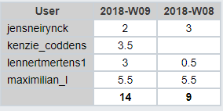

# Lastenboek Taak 1: Lab 4 - Basic Static Route Configuration

* Verantwoordelijke uitvoering: `Maximilian Leire`
* Verantwoordelijke testen: `Jens Neirynck`

## Deliverables

* Een correcte netwerktopologie opzetten en initialiseren
* Verwijderen van de startup configuratie en het herladen van de standaard configuratie van de router.
* Debuggen van ip routing
* Configureren van Serial en Ethernet interfaces
* Configureren van een Static route

## Deeltaken

* Basis router configuratie
* De connectiviteit testen
* Het zoeken naar de oorzaak van een probleem met een verbinding
* Documenteren van de implementatie

## Tijdbesteding

| Student         | Geschat | Gerealiseerd |
| :---            |    ---: |         ---: |
| Max Leire  |         5.5|       5.5       |
| Jens Neirynck |      2|      3      |
| Lennert Mertens  |         3|       0.5      |
| Kenzie Coddens |      3.5|      0      |

(na oplevering van de taak een schermafbeelding toevoegen van rapport tijdbesteding voor deze taak)

