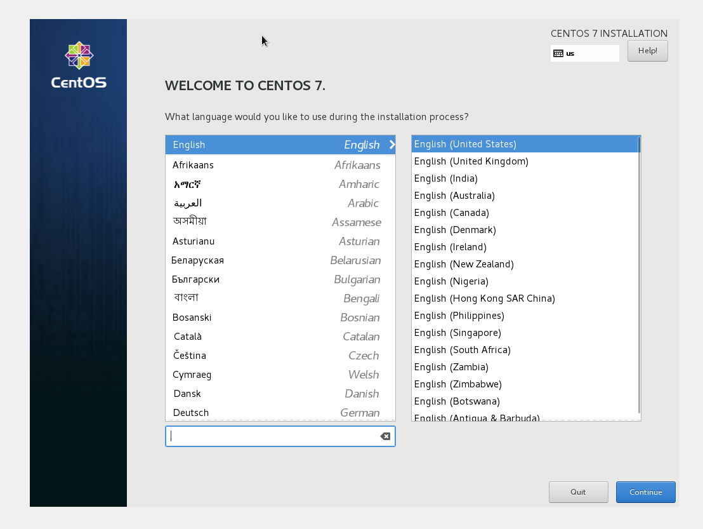
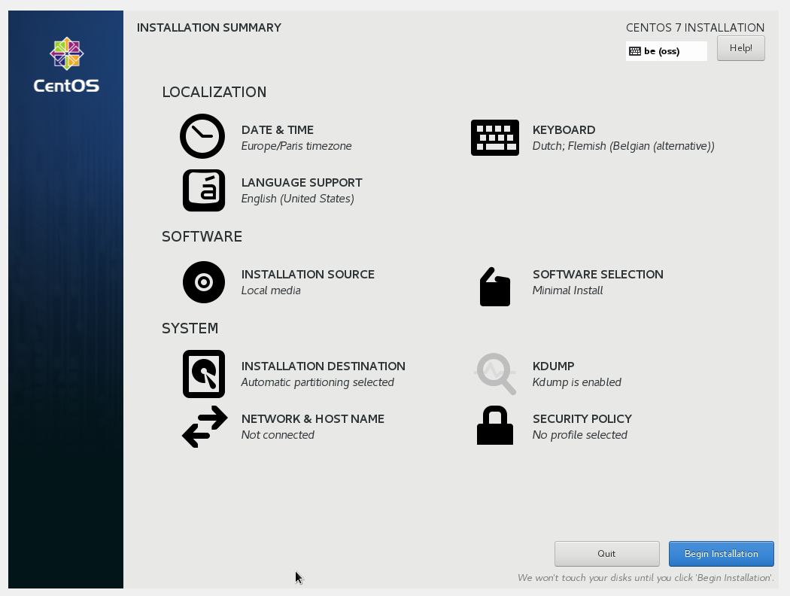
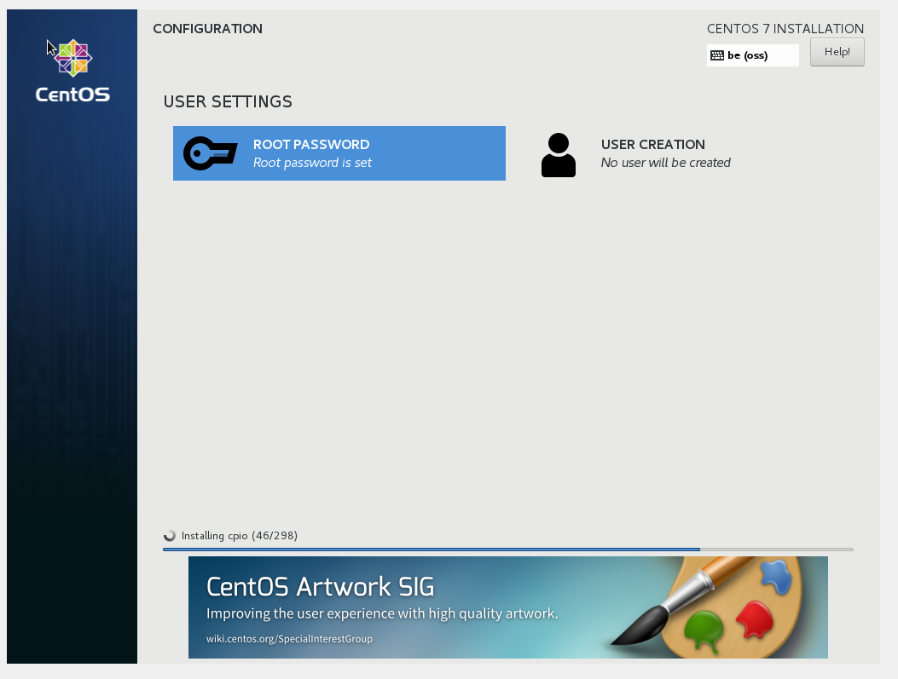

# Documentatie: Installatie Cent OS 7

## Basisinstallatie CENTOS 7

### Stap 1:
* Selecteer de gewenste taal, meestal zal hier Engels worden geselecteerd, aangezien het gemakkelijker is voor support.

### Stap 2:
* Alle instellingen waar een icoontje bij staat hoeven uitgewerkt te worden.

  * Tijdzone

  * Taal

  * Toetsenbord

  * Bron van installatie

  * Software selectie

  * Installatie bestemming

  * Netwerk & Host name

  * KDUMP

  * Security Policy

* Na de verplichte instellingen in te stellen kan u de installatie beginnen.

### Stap 3:

* Er moet ook een root password worden gemaakt, je kan ook kiezen om een extra gebruiker (met of zonder rootrechten) aan te maken.

