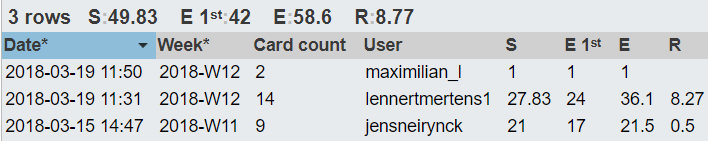

# Lastenboek Opdracht 02: LAMP (automatisering)

* Verantwoordelijke uitvoering: `Lennert Mertens` & `Jens Neirynck`
* Verantwoordelijke testen: `Kenzie Coddens` & `Max Leire`

## Deliverables

* Een bash script dat zorgt voor automatisering om een LAMP stack op te zetten
* Vagrantfile met de juiste configuratie instellingen
* Config file waarin we gebruiker zaken zoals paswoorden laten definiëren 
* Voorgaande 3 elementen eventueel bundelen in een mooie package
* Lastenboek
* Testplan
* Testrapport
* Alle geproduceerde documenten op GitHub

## Deeltaken

* Vooraleer we aan de opdracht beginnen moeten we uitzoeken hoe en wat Vagrant is (Bronnen beschreven in 
* Vagrant gebruik documenteren
* Als oefening voor we het script schrijven handmatig een LAMP opzetten (Fedora 27)
* Documenteren over hoe een LAMP op te zetten op Fedora 27 om hierop terug te vallen bij het schrijven van het script
* Script met automatische installatie waarbinnen: Apache + PHP + MariaDB + MySql wordt geinstalleerd
* Aangemaakt en geconfigureerd Vagrant file met daarin de juiste instellingen (netwerkkaarten, naam, aantal RAM, ... )
* Configuratiefile waarin de gebruiker zijn voorkeuren definieert
* Readme bestand met daarin uitleg voor de gebruiker over hoe hij de configuratiefile moet aanpassen naar zijn eigen noden en wensen

## Tijdbesteding

| Student         | Geschat | Gerealiseerd |
| :---            |    ---: |         ---: |
| Lennert Mertens |    30   |      28,3    |
| Jens Neirynck   |    26   |      21      |
| Maximilian Leire (tester)  |   1    |      1      |

