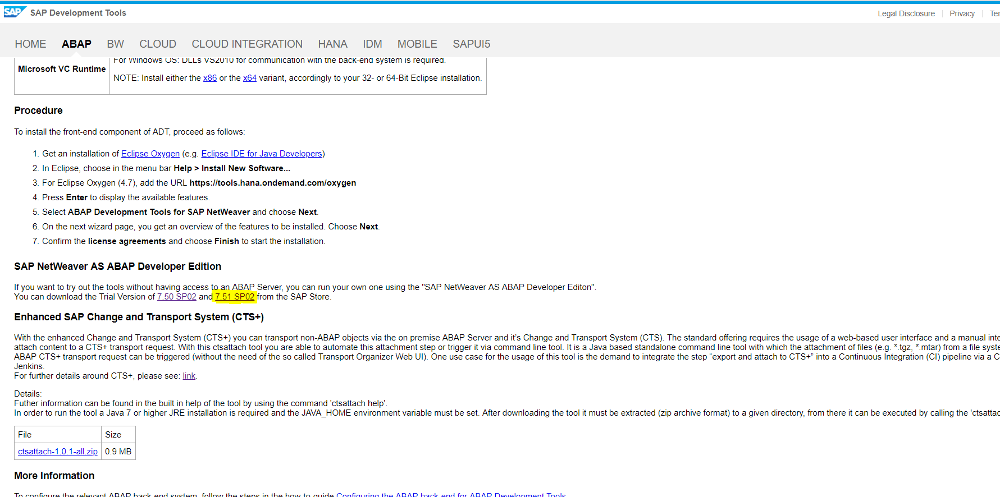
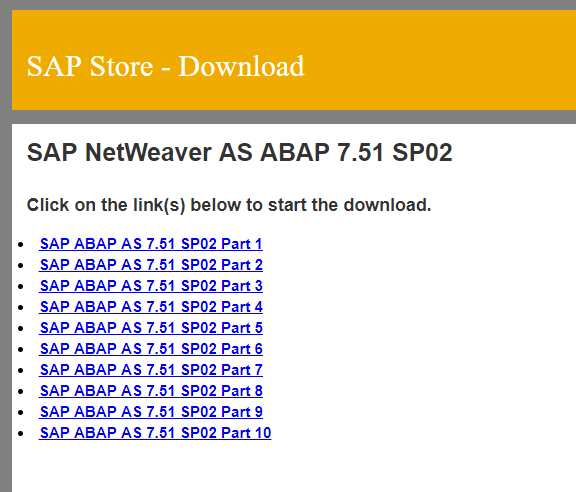

# Documentatie SAP installatie
## Software downloaden
### Stap 1: SAP software downloaden
- Surf naar: `https://tools.hana.ondemand.com/#abap`
- Klik door op de aangeduide link


- Indien u nog niet over een account op het `SAP Cloud platform` beschikt, registreer dan eerst een nieuw account
- U wordt doorverwezen naar de `SAP store`, op deze pagina kan u SAP downloaden
- U kiest voor `Trial version`
- Vervolgens moet u uw accountgegevens verder aanvullen


- Als u alle vorige stappen goed heeft doorlopen dan zal u nu een mail hebben gekregen waarin de download link staat naar de SAP download pagina. 
- U download de 10 Zip bestanden (dit kan even duren)



- Wanneer dit voltooid is kopieert u `Alle 10 Zip bestanden` naar een zelfaangemaakte map
- Selecteer alle 10 de Zip bestanden en pak deze bestanden in deze map uit


(De geselecteerde zips mogen na het uitpakken worden verwijderd)

## Installeren Linux SUSE VM
### Stap 1: De Linux ISO downloaden.
* Ga naar https://software.opensuse.org/distributions/leap
* Klik op de editie `DVD image` en dan `directe verbinding`.
* De iso wordt nu gedownload.
* Vergeet de locatie van de ISO niet!!!

### Stap 2: De Linux machine toevoegen aan VirtualBox
* Open VirtualBox
* Klik op `Nieuw`
* Voor als naam `OpenSuse` in
* kies voor `OpenSuse 64 bit`
* Klik op next
* Kies als hoeveelheid `RAM 6040`
* Klik next
* Maak een nieuwe virtuele harde schijf aan met als grootte 100 GB (VDI, dynamisch gealloceerd)
* Klik next
* Maak de nieuwe VM aan


### Stap 3: De Linux machine configureren en installeren.
* Start de virtuele machine en boot vanaf de gedownloade ISO
* Kies voor `Installation`
* Selecteer de gewenste taal en toetsenbordlayout
* Klik next
* Klik `Edit proposal settings` en selecteer volgende opties (Belanrijk!)


* Klik OK
* Klik next
* Selecteer tijd en regio
* Klik next
* Selecteer `GNOME Desktop`
* Klik next

* Maak een nieuwe gebruiker aan vb: 
```
User full name: Project Leider
Username: projleid
Password: C1sc0Cl4ss (Belangrijk om wachtwoord van dit formaat te gebruiken (later))
```
* Klik next
* Bij overzicht installatie: Firewall and SSH (Controleer in screenshot)
```
Enable je SSH service door op enable te duwen
Disable ook je firewall
```


* Druk `Install`
* Druk nogmaals `Install`
* Wacht tot het systeem herstart
* Selecteer `Virtual Box menu` > `Devices` > `Eject ISO` 
* Selecteer `Virtual Box menu` > `Devices` > `Shared Clipboard Bidirectional` 


## Installeren Tools en SAP
* Open `Terminal`
* Typ volgend commando: 
```
projleid@localhost:~> sudo zypper in nano uuidd
...
root's password: C1sc0Cl4ss
```
* Typ '**y**' wanneer er input wordt gevraagd
* Open volgende file: 
```
projleid@localhost:~> sudo nano /etc/hostname
```
* Maak deze file leeg en zet er dan exact volgende uitvoer in: `vhcalnplci`
* Sla deze file op

* Open volgende file: 
```
projleid@localhost:~> sudo nano /etc/hosts
```
* Voeg onderaan deze file `10.0.2.15 vhcalnplci vhcalnplci.dummy.nodomain` toe
* Sla deze file op

### Shared folder met hostsysteem opzetten 
* Selecteer `Virtual Box menu` > `Devices` > `Shared Folders` > `Shared Folder settings` > Selecteer de map die de uitgepakte zips bevat

* Vink volgende instellingen aan:


* Klik tweemaals op `Ok`
* Herstart het systeem
* Open `Terminal`
* Typ volgend commando: 
```
projleid@localhost:~> sudo -i
root's pawword: C1sc0Cl4ss
vhcalnplci: ~ # cd /media
vhcalnplci: /media #

Selecteer nu de shared folder met cd:
vhcalnplci: /media # cd sf_SAP

Stel de script permissies in:
vhcalnplci: /media/sf_SAP # chmod +x install.sh
vhcalnplci: /media/sf_SAP # ./install.sh

Druk enter!
Druk continue op spatie tot het systeem komt vragen 'Do you agree to the above license terms? yes/no:
Typ 'yes' en druk op enter
Geef het juiste paswoord in: C1sc0Cl4ss (moet bestaan uit letters, hoofdletters, cijfers en 8 lang)
Druk enter
Voer het paswoord nogmaals in
Druk enter
```
* Na het uitvoeren moet u volgende melding krijgen: 


* Sluit de machina na de installatie af

### Poorten instellen op VM
* Selecteer `Instellingen` van je Virtuele Machine
* Selecteer dan `Netwerk`
* Selecteer `Geavenceerd`
* Selecteer `Port forwarding`
* Configureer de poorten volgens volgende screnshot


Na al deze stappen kan de gebruiker de Client installeren en verbinding maken met de ingestelde SAP Server!
