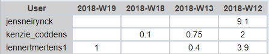

# Lastenboek Opdracht 02: SAP

* Verantwoordelijke uitvoering: `Jens Neirynck` & `Lennert Mertens`
* Verantwoordelijke testen: `Kenzie Coddens`

## Deliverables
* Lastenboek
* Testplan
* Testrapport
* Documentatie voor opzetten SAP omgeving
* Handleiding voor gebruiker
* SAP server (draait op openSUSE Linux)
* Client install op hostmachine voor SAP gebruik

## Deeltaken
* Opzetten Linux server openSUSE
* Informatie verzamelen omtrent SAP
* SAP Installeren
* Stappenplan/documentatie maken voor installatie
* Testen

## Tijdbesteding

| Student          | Geschat | Gerealiseerd |
| :---             |    ---: |         ---: |
| Lennert Mertens  |     4   |         5.3  |
| Jens Neirynck    |     5    |         9.1     |
| Kenzie Coddens   |     3    |       2.85       |

