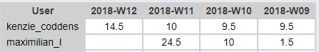

# Lastenboek Taak 2: Opstellen van een WISA stack via Vagrant

* Verantwoordelijke uitvoering: `Maximilian Leire & Kenzie Coddens`
* Verantwoordelijke testen: `Jens Neirynck & Lennert Mertens`

## Deliverables

* Maken van een custom Vagrant box via packer.
* De Vagrant box correct initialiseren.
* WISA stack automatisch laten installeren aan de hand van een powershell script.
* Installeren ASP.NET applicatie op de server.
* Een ConfigurationFile voorzien voor een custom installatie van SQL Server.
* Een netwerk addapter voorzien zodat website vanop host bereikbaar is.

## Deeltaken

* Opzoeken info omtrent Vagrant, Packer
* Installeren hulp-applicaties chocolatey, cmdir, git bash
* Leren werken met PATH-variabele in windows
* Opzoeken en testen van powershell commando's
* Testen van timing in een powershell script in samenwerking met vagrant.

## Tijdbesteding

| Student         | Geschat | Gerealiseerd |
| :---            |    ---: |         ---: |
| Maximilian Leire  |         50|  42.5            |
| Kenzie Coddens |      46|          43.5   |

