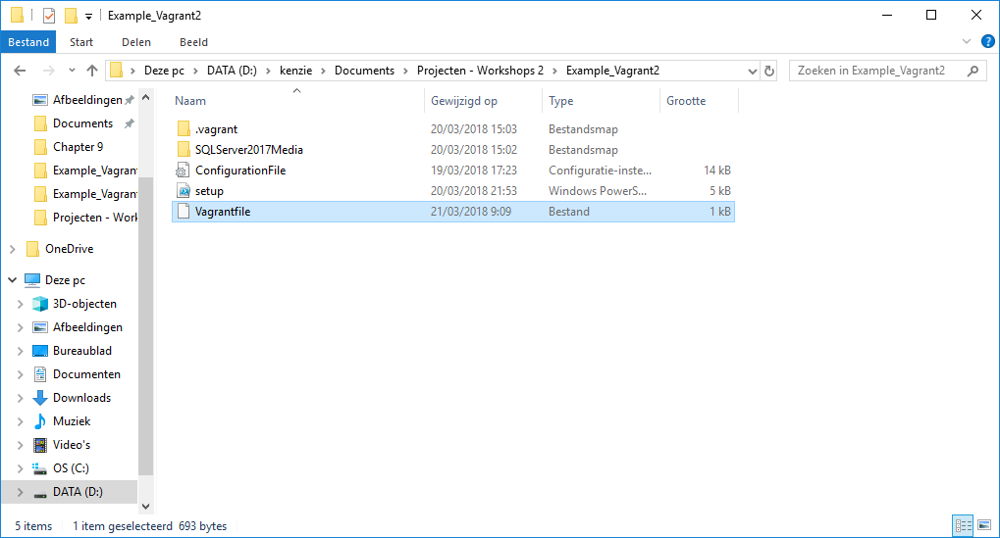
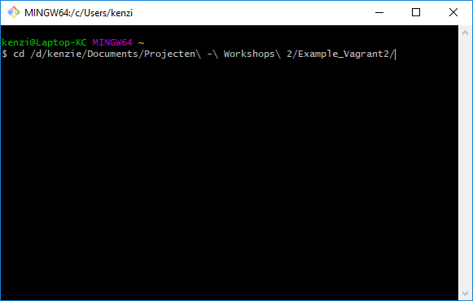

# Gebruiks Aanwijzing voor Vagrant script met automatische configuratie.
## Benodigdheden:
* Vagrant
* VirtualBox
* Files
## Voorbereiden van mappen en packages.
*Een simpel stappenplan om snel uw WISA stack online te hebben. Hou rekening met de locatie waar U uw vagrantfile gaat aanmaken zodat U gemakkelijk de locatie terug vindt. Zorg ook dat U opvoorhand weet op welke schijf VirtualBox zijn virtuele disk aanmaakt want deze zal een grote hebben van 60GB max.*
### Stap 1:
* Maak een folder aan ergens op uw pc waar u de meegeleverde files in plaatst.
* Er moet dus instaan (SQLServer2017Media, ConfigurationFile.ini, Setup.ps1, VagrantFile, windows_2016_virtualbox)


## Uitvoeren van de automatische configurtie.
*De scripten geven U een zeer basis installatie van een WISA stack zonder management tools. Deze installatie kan tot 40 minuten in beslag nemen (afhankelijk van uw internet snelheid). Internet vereist.*
### Stap 1:
* Open nu uw Git Bash of uw CMD'ER en navigeer naar de folder waar uw VagrantFile staat (Voorbeeld):
```
cd /d/Kenzie/Documents/Projecten\ -\ Workshop\ 2/Example_Vagrant2/
```


* U moet de meegeleverde box laten toevoegen aan uw vagrant folder. Dit proces kan even duren. Type:
```
vagrant box add --name windows_2016 windows_2016_virtualbox.box
```
* Type nu:
```
vagrant up
```
* De installatie en configuratie zou nu moeten beginnen.

*Gelieve tijdens de installatie U niet in te loggen op de virtuele machine. U kunt zich later inloggen op het account `Vagrant` met wachtwoord `vagrant`. NOTE: KEYBOARDLAYOUT IN LOCK SCREEN IS QWERTY.*
## Toevoegen van de virtuele machine aan VirtualBox.
*Hier tonen we hoe U simpel uw Virtual Machine terug kunt vinden in VirtualBox.*
### Stap 1:
* Open VirtualBox.
* Onder het menutje `machine` klik op `Machine toevoegen`.
* Navigeer nu naar de locatie waar uw VirtualBox drives standaard worden opgeslagen.
* Open de map en zoek naar de image van uw box.
* Selecteer deze en voeg toe.
## Installeren van extra tools.
*Deze tools zijn niet allemaal verplicht maar zijn wel zeer nuttig of soms nodig om bepaalde functionaliteit te realiseren.*
### Installeren van extra packages voor IIS.
#### Stap 1:
* Volg Appendix A van de [handleiding](https://github.com/HoGentTIN/p2ops-g09/blob/master/opdrachten/opdracht02/WISA/documentatie/Installatie_Handleidingen/Installatie_IIS&ASP_NET.md).
#### Stap 2:
* Volg Appendix B van de [handleiding](https://github.com/HoGentTIN/p2ops-g09/blob/master/opdrachten/opdracht02/WISA/documentatie/Installatie_Handleidingen/Installatie_IIS&ASP_NET.md).
## Toevoegen van een Applicatie.
*Volg de [handleiding](https://github.com/HoGentTIN/p2ops-g09/blob/master/opdrachten/opdracht02/WISA/documentatie/Installatie_Handleidingen/Installatie_ASP.NET_Applicatie.md).*
### Alternative manier met WebDeploy.
#### Stap 1:
* open in de server manager onder de menu `Tools` de IIS-Manager.
* Ga in de linker kolom naar `default website` en klik in de rechter kolom op `import applicatie`.
* Volg nu de wizard.
