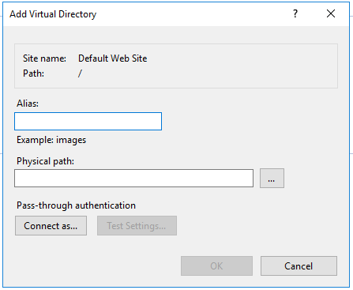
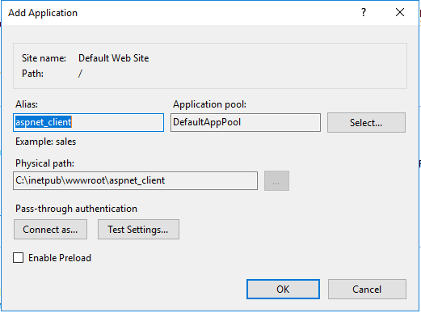
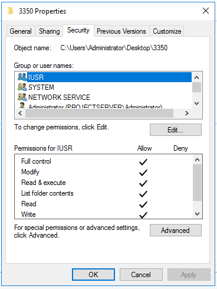
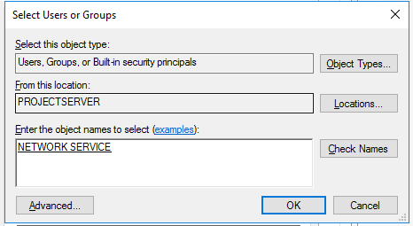
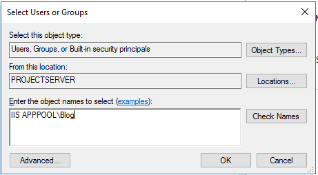
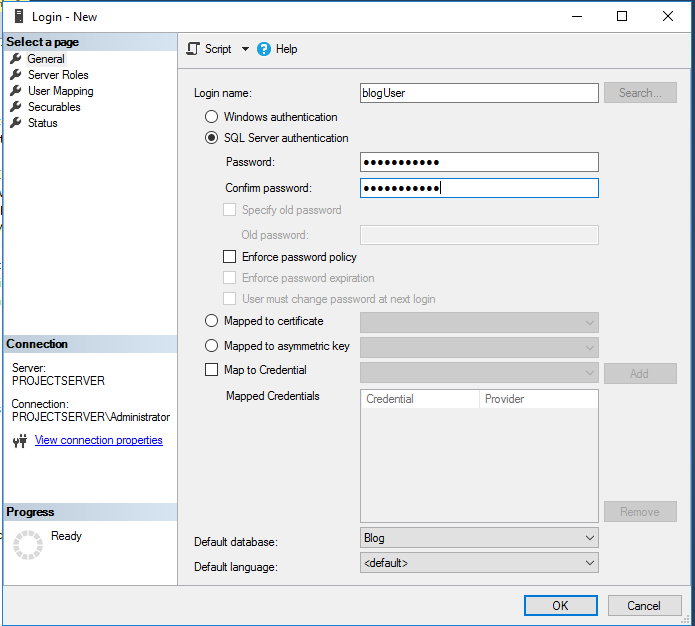
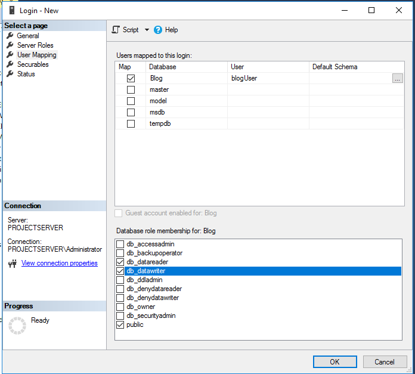
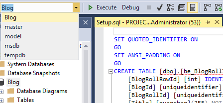
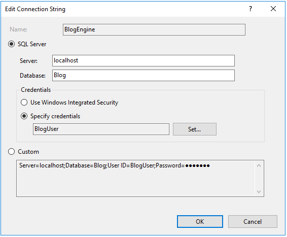

# Documentatie: Installatie ASP.NET-applicatie (Voorbeeld BlogEngine.NET)

### Benodigdheden
* Windows server 2016
* SQL server management studio
* IIS
* ASP.NET 4.0

## Stap 1: Voorbereiding

Rechterklik de gewenste website (in dit geval default) en kies voor `Add virtual directory` .

Geef deze een gepaste Alias en geef het pad op waar uw files voor de applicatie zich bevinden.  

  

Klik op `OK`.

Rechterklik op uw zojuist gecreeërde folder en kies voor `Convert to application`.  

  

Kies hier voor `Select...` .

Kies bij application pool voor `ASP.NET V4.0`.

Klik op `OK` .

## Stap 2: Geven van de correcte rechten

Rechterklik op uw applicatie en kies voor `Edit Permissions...`.

Ga dan naar het tabblad `security`.  

  

Klik op `Edit...` en vervolgens op `Add...`.

Type hier de naam `Network service` druk vervolgens op `Check Names` en dan op `OK`.

Type dan de naam `IUSR` druk vervolgens op `Check Names` en dan op `OK`.  

  

Geef deze gebruikers beiden `full control` .

Ga nu naar de permissies van de folder `App_Data` en kies terug voor `Edit...`.

Kies hierna voor `Locations...` en selecteer de bovenste optie (de naam van uw server) en klik op `OK`.

Type dan `IIS APPPOOL\[de naam van uw site]`en kies weer voor `Check Names` en dan op `OK`.  

  

Geef deze gebruiker ook `Full control`.

Nu zal je applicatie correct werken.

## Stap3: SQL server implementatie (Maak hier gebruik van SQL server management studio.)

### Aanmaken van de database

Rechterklik op Databases en kies voor `New Database...`.

Geef deze een gepaste naam en klik op `OK`.

### Creeëren van een nieuwe login
Rechterklik op de folder `Security > Logins` en kies voor `New Login...`.

Kies uw naam, selecteer SQL Server authentication en geef uw paswoord in.

Vink `Enforce password policy` uit.

Kies bij `Default database` voor de zojuist gecreeërde databank.  

  

Klik nu links op `User Mapping`.

Vink de zojuist gemaakte databank aan.

Vink nu ook `db_datareader` en `db_datawriter` aan.

Klik op `OK`.  

  

Indien er zich later een error voor doet bij het verbinden met de database in verband met rechten geef deze gebruiker dan de rechten als `sysadmin` om dit op te lossen. (Enkel in testomgeving!!)
### Toevoegen data

Navigeer naar je SQLServer script. (Hier BlogEngine.NET\setup\SQLServer\MSSQLSetupx.x.x.x)

Open deze file in SQLServer management studio.  

Selecteer de daarnet aangemaakte database en klik op `Execute`.  

  

Je `Tables` folder bij je database is nu aangevuld.

### De applicatie instellen om SQL Server te gebruiken

Kopieer het XMLconfiguratie-bestand `SQLServerWeb` naar je main `BlogEngine.NET`folder.

Hernoem het `Web` XML-bestand naar `Web.Old`.

Hernoem `SQLServerWeb` naar `Web`.

### De verbinding met de database instellen in IIS

Ga terug naar je ISS manager, selecteer uw applicatie en kies voor `Connection Strings`.

Rechterklik op de connection en kies voor `Edit...`.

* Selecteer SQL Server
* Geef bij server `localhost`in.
* Geef de naam van uw databank in.
* Klik op `Set...` en geef hier de credentials van de eerder aangemaakte gebruiker in en klik op `OK`.
* Klik op `OK`.  

  

Herstart uw applicatie door links op uw applicatie te dubbelklikken en dan rechts op `Restart` te klikken.

