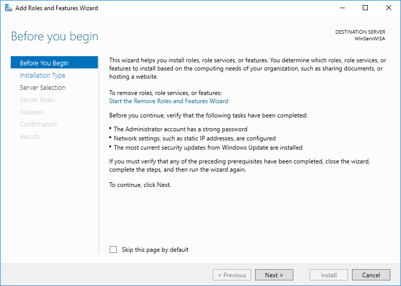
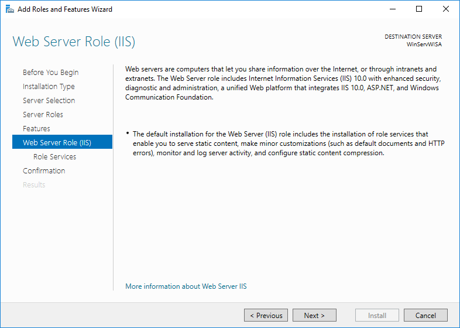
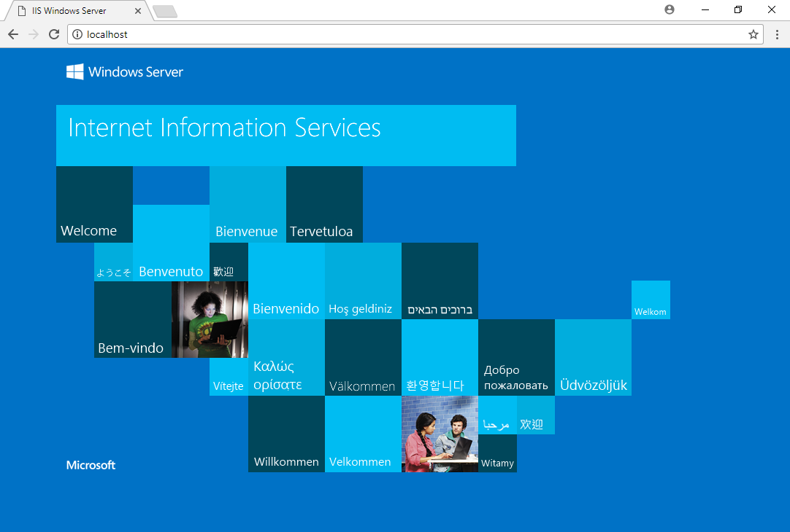
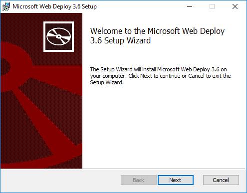

# Documentatie: Installatie IIS & ASP.NET

## Basisinstallatie IIS & ASP.NET

### Stap 1:
* Ga in het Server Manager vestere naar `Add Roles And Features`.


* Er opende een nieuw installatie venster. Klik op next.


* Kies voor Role-based or feature-based installation en klik op next.


* Klik op next.


* Kies voor Web Server (IIS) en vink aan. Klik next.


* Klik op Add Features.


* Zorg dat alles geselecteerd is zoals onderstaande afbeelding en klik op next.


* Klik op next.


* Selecteer alle opties op FTP Server na en klik next.


* Klik op install.


* Na het eindigen van de installatie klik op close.


### Stap 2:
* Zoek nu in het Server Manager venster onder Tools naar de IIS manager en open de tool.


* Nu zouden onderstaande mappen zichtbaar moeten zijn.


* Open een nieuw browser venster en type in de adresbalk `localhost`. Druk enter.


* Als alles correct verlopen is dan zou nu onderstaande pagina moeten verschijnen.


## Appendix A:
*Er mankeren knoppen in de GUI van de IIS manager waardoor het toevoegen van een website moeilijk verloopt. Deze wizard brengt deze knoppen terug die in een oudere editie zaten.*
### Stap 1:
* Surf naar: https://www.iis.net/downloads/microsoft/web-deploy en download de extension.

* Voer de .exe uit.


* Er wordt een nieuw installatie scherm geopend. Klik op next.


* Accepteer de licentie overeenkomst na het lezen ervan en klik op next.


* Kies voor `Typical`.


* Klik op Install.


* De installatie begint nu.


* Na het eindigen van de installatie klik op close.


## Appendix B:
*Vooraleer het mogelijk wordt om succesvol een applicatie toe te voegen in de IIS-Manager, moet er nog een pakket worden geinstalleerd.*
### Stap 1:
* Surf naar: https://microsoft.com/web/downloads/platform.aspx en download de extension.


* Voer de .exe uit.


* Accepteer de licentie overeenkomst na het lezen ervan en klik op install.
 

* De installatie begint nu.


* Na het eindigen van de installatie klik op finish.


### Stap 2:
* Zoek naar de applicatie: `Web Platform Installer 5.0` en open de applicatie.


* Na het openen ga naar het tapblad `Products`.

* Zoek onder de categorie `Database` naar `SQL Server 2008 R2 Management Objects` en klik op Add.


* Klik dan op install


* Er opende een nieuw installatie venster. Klik op I Accept.


* De installatie zou nu moeten beginnen.


* Na het eindigen van de installatie klik op Finish.


## Appendix C:
*Installeren van de IIS-Manager en de ASP.NET Rollen via powershell.*
### Stap 1:
* Open Powershell ISE.

* Type regel per regel:
```
install-windowsfeature -name Web-Server -includeallsubfeature -IncludeManagementTools -Confirm:$false
install-windowsfeature -name NET-Framework-Features -includeallsubfeature -Confirm:$false
install-windowsfeature -name NET-Framework-45-Features -includeallsubfeature -Confirm:$false
```
* Alle benodigde features zijn geinstalleerd. 
