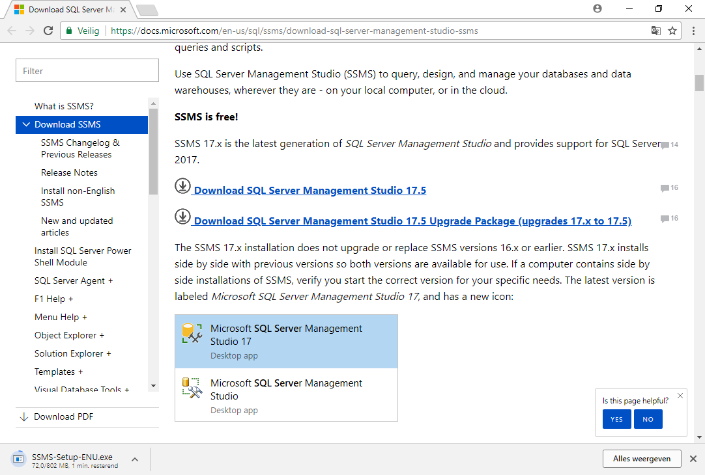

# Documentatie: Installatie SQL Server

## Basisinstallatie SQL Server

### Stap 1:
* Surf naar https://www.microsoft.com/nl-be/sql-server/sql-server-downloads en download de Express-editie.

* Open de .exe en voer het uit.

### Stap 2:
* Klik op custom install.

* Verander eventueel de doel locatie/folder voor de installatie.

* Kies install en wacht.

 ### Stap 3:
 * Nadat de installatie klaar is wordt er automatisch een installer menu geopend. Kies hier onder de categorie `installation` voor: `New SQL Server stand-alone installation or add new features to an existing installation`.
 
 
 ### Stap 4:
 * Accepteer de licentie overeenkomst na het lezen ervan en klik op next.
 
 
 * Klik op next.
 
 
 * Het installatie programma doet een aantal controles. Na afloop klik next.
 
 
 * In het `Feature Selection` paneel klik op `Select All`. Verander ook eventueel de doel locatie/folder voor de installatie. Klik next.
 

* Het installatie programma doet een controle ofdat er zich problemen kunnen voordoen tijdens het installatie-proces. Indien U onderstaande foutmelding krijgt ga naar Appendix A. Klik next.

* Kies `Named instance` als het nog niet geselecteerd is en geef een naam in. Klik hierna op next.

* In het PolyBase Configuration paneel kiest U de eerste optie vermits we een nieuwe stand alone node willen installeren en klik next.

* Het installatie programma toont nu een aantal opties voor gebruikers. Laat alles zoals aangegeven en klik next.

* Kies nu in het tab-blad `Server Configuration` voor de optie `Mixed Mode`. Dit is belangerijk omdat de meeste Applicaties automatisch de databank genereren volgens een script en dan gebruiken ze het standaard SA account in SQL-Server. Kies een wachtwoord en bevestig. Klik op next.

* Klik op accept. Daarna klik op next.

* Klik op accept. Daarna klik op next.

* De installatie begint nu. Dit kan enige tijd in beslag nemen. (+-10 minuten).

* Na afloop van de installatie toont het installatie programma een rapport van de installatie. Klik op close. De install menu opent terug.

### Stap 5:
* Selecteer in het installatie menu `Install SQL Server Reporting Services`.

* Er wordt een browser venster geopend. Klik op `Download now`. De download wordt gestart.

* Open de .exe en voer uit.

* Er wordt een nieuw isntallatie venster geopend. Klik op `install reporting services`.

* Verander de edition en klik op next.

* Accepteer de licentie overeenkomst na het lezen ervan en klik op next.

* Klik op next.

* Verander eventueel de doel locatie en klik next.

* De installatie begint nu. Na afloop van de installatie klik close.

### Stap 6:
* Selecteer in het installatie menu `Install SQL Server Management Tools`.

* Er wordt een browser venster geopend. Klik op `Download SQL Server Management Studio 17.5`. De download begint.

* Voer de .exe uit.

* Er wordt een nieuw installatie scherm geopend. Klik op install.

* Nadat de installatie afgelopen is klik op close.

## Appendix A:
### Stap 1:
* U heeft een foutmelding gekregen tijdens de controle ofdat het installatie proces onafgebroken kan doorgaan.

* Deze foutmelding komt alleen als U geen versie van java geinstalleert heeft op uw toestel.

* Ga naar google en zoek op `java`. Klik op `gratis java software downloaden`

* Klik op `gratis java download`.

* Klik op `Ga akkoord met de licentiebepaling en start de gratis dwonload`. De dowload zou nu moeten beginnen.

* Na afloop van de dowload run de .exe.

* Klik op `Install >`.

* Laat de installatie lopen.

* Als de installatie afgerond is, klik op `Close`.

* Ga nu terug naar het installatie programma van SQL Server en klik op `Re-Run`. Na afloop zou de next knop beschikbaar moeten zijn.

