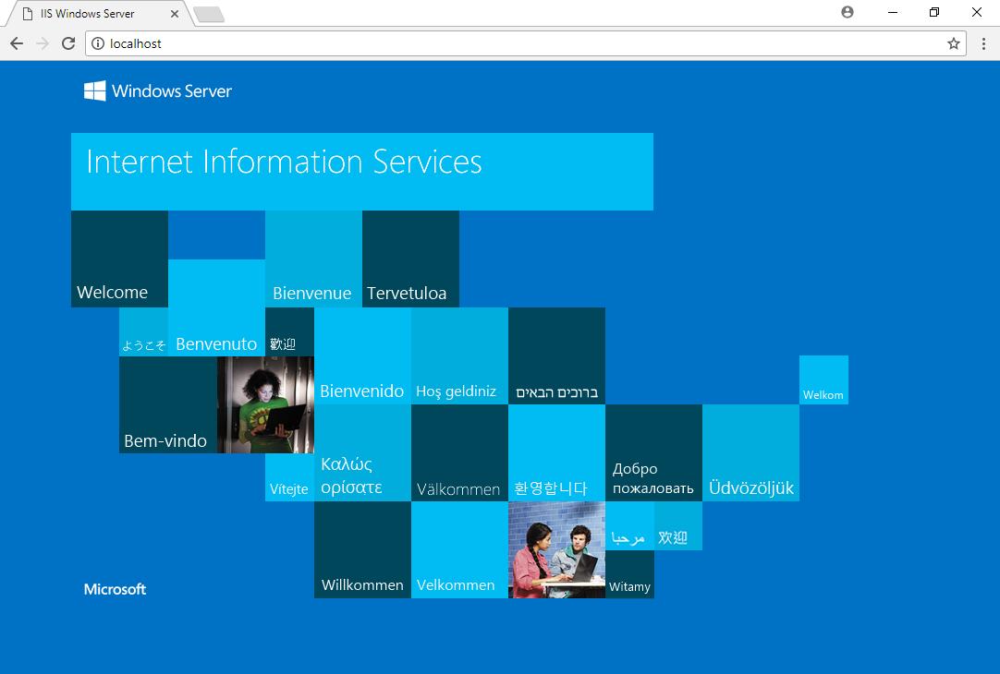

# Testplan Opdracht 02: WISA automatisatie

## Alle te testen onderdelen in secties onderverdeeld: 

### Aanwezigheid van Documentatie

| Vereist       | Aanwezig      | Commentaar |
| ------------- |:-------------:| ---------- |
| windows_2016_virtualbox.box | |   |
| ConfigurationFile | |   |
| GebruiksAanwijzing | |   |
| Insitallatie_ASP.NET_Applicatie.md | |   |
| Insitallatie_IIS&ASP_NET.md | |   |
| Insitallatie_SQL_Server.md | |   |
| Insitallatie_Windows_Server2016.md | |   |
| Opzetten_Vagrant.md | |   |

### Vagrant folder aanmaken
*Volg de gebruiksaanwijzing, [Voorbereiden van mappen en packages](https://github.com/HoGentTIN/p2ops-g09/blob/master/opdrachten/opdracht02/WISA/documentatie/GebruiksAanwijzing.md)*

- [ ] Er is een map gemaakt met de benodigde bestanden.
- [ ] Er bestaat een ConfigurationFile
- [ ] Er bestaat een map SQLServer2017Media
- [ ] Er bestaat een PowerShell script Setup.ps1
- [ ] Er bestaat een VagrantFile
- [ ] Er bestaat een VirtualBox Box windows_2016_virtualbox.box

### Vagrant server opstarten
*Volg de gebruiksaanwijzing, [Uitvoeren van de automatische configuratie](https://github.com/HoGentTIN/p2ops-g09/blob/master/opdrachten/opdracht02/WISA/documentatie/GebruiksAanwijzing.md)*

- [ ] `vagrant box add --name windows_2016 windows_2016_virtualbox.box` voegt de box toe
- [ ] Vagrant up start de machine
- [ ] De installatie van Windows Server verloopt zonder errors

### ASP.NET & IIS

- [ ] Surf op uw host systeem in uw browser naar `10.10.10.4`
- [ ] Surf in uw virtualbox naar `localhost`

### SQL

- [ ] SSMS (Sql Server Management Studio) is geinstalleert
- [ ] Er kan verbinding gemaakt worden in SSMS met de databank

### VirtualBox toevoegen aan VirtualBox
*Volg de gebruiksaanwijzing, [Toevoegen van de virtuele machine aan VirtualBox](https://github.com/HoGentTIN/p2ops-g09/blob/master/opdrachten/opdracht02/WISA/documentatie/GebruiksAanwijzing.md)*

- [ ] Er werd een VirtualBox toegevoegd aan VirtualBox

### Overige testen
*Volg de gebruiksaanwijzing, [Toevoegen van een applicatie](https://github.com/HoGentTIN/p2ops-g09/blob/master/opdrachten/opdracht02/WISA/documentatie/GebruiksAanwijzing.md)*

- [ ] Er werd succesvol een webapplicatie toegevoegd op 1 van de 2 manieren
- [ ] Surf op uw host systeem in uw browser naar `10.10.10.4`
- [ ] Surf in uw virtualbox naar `localhost`

Auteur(s) testplan: Jens Neirynck

