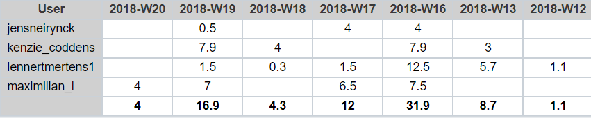

# Lastenboek Opdracht 3: Project VastGoed

* Verantwoordelijke: `Maximilian Leire, Kenzie Coddens, Jens Neirynck & Lennert Mertens`

## Deliverables

**Demo** tijdens de contactmomenten (datum nader te bepalen) van:

- Gesimuleerde omgeving binnen Packet Tracer
- Proof-of-concept met de huidig beschikbare Cisco apparaten

**Presentatie** (op maandag 23/4/18):

- Het voorstel van de nieuwe netwerkinfrastructuur presenteren jullie per team op een nader te bepalen moment aan de studenten vastgoed in het bijzijn van de begeleidende lectoren. Hierbij gaan jullie vooral in op de algemene opstelling van de netwerkinfrastructuur, de voor-/nadelen van jullie opstelling, een lijst van het benodigde materiaal, ... De presentatie is zowel technisch als commercieel waarbij de klant overtuigd wordt van jullie oplossing zodat ze in zee kunnen gaan met de juiste partner.

Op **Github**:

- Lastenboek
- Alle achtergrondinformatie die jullie verzameld hebben om met de opdracht aan de slag te kunnen gaan
- Fysieke en logische topologie van de netwerkinfrastructuur
- Packet Tracer bestanden met de simulatie van de netwerkinfrastructuur
- Een lijst van nodige materialen, inclusief prijzen
- Gedetailleerde installatieprocedures en scripts (gericht naar de teamleden)
- Handleiding voor gebruikers, i.e. klant
- Testplannen en testrapporten

## Deeltaken

* 

## Tijdbesteding

| Student           | Geschat | Gerealiseerd |
| :---              |    ---: |         ---: |
| Maximilian Leire  |      20   |      21        |
| Kenzie Coddens    |    16   |    22.8      |
| Jens Neirynck     |    15   |    8.5       |
| Lennert Mertens   |    23.2 |    23.6      |

(na oplevering van de taak een schermafbeelding toevoegen van rapport tijdbesteding voor deze taak)
