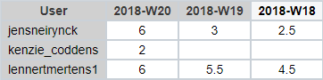

# Lastenboek Opdracht 4: Microsoft Deployment Toolkit

* Verantwoordelijke uitvoering: `Lennert Mertens` & `Jens Neirynck`
* Verantwoordelijke testen: `Maximilian Leire`

## Deliverables
* Virtuele omgeving waarop de MDTK werd geïnstalleerd
* Uitgerolde Windows 10 pc met gevraagde applicaties
* MDTK ISO
* Testrapport
* Documentatie
* Lastenboek

## Deeltaken
* Testplan voor testrapport
* Installatie
* Installatie documentatie

## Tijdbesteding

| Student          | Geschat | Gerealiseerd |
| :---             |    ---: |         ---: |
| Lennert Mertens  |    6.5  |        15.5  |
| Jens Neirynck    |     6.5    |        11.5    |
| Kenzie Coddens   |     -  |        2     |
| Maximilian Leire |     1.5    |       6       |

