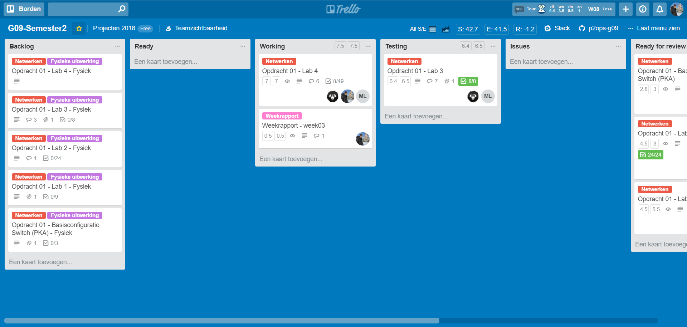
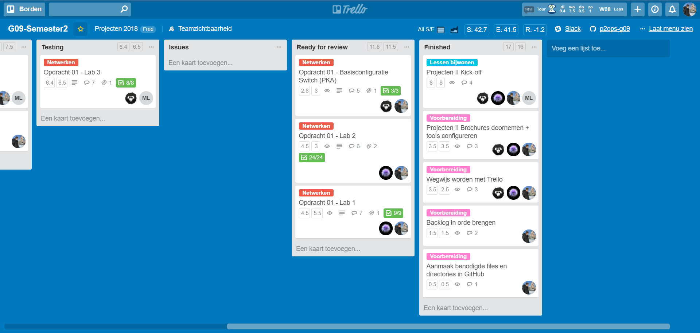
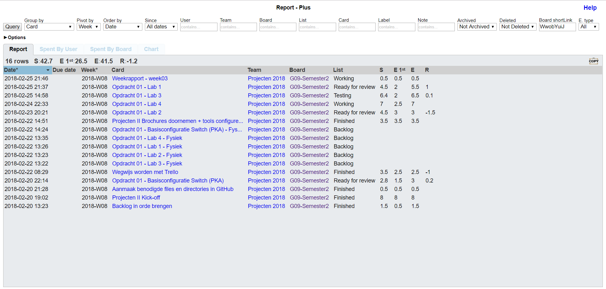
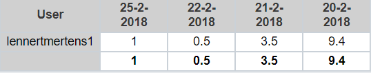
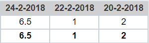
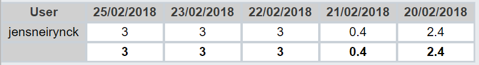
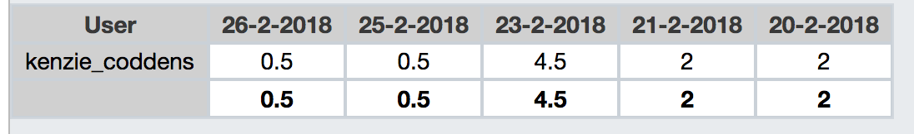

# Voortgangsrapport week 03

* Groep: g09
* Datum: 26/02/2018

| Student          | Aanw. | Opmerking |
| :---             | :---  | :---      |
| Lennert Mertens  |   X   |           |
| Maximilian Leire |   X   |           |
| Jens Neirynck    |   X   |           |
| Kenzie Coddens   |   X   |           |

## Wat heb je deze week gerealiseerd?

### Algemeen

[Afbeelding huidige toestand Kanban-bord]

[Afbeelding teamoverzicht tijdregistratie onderverdeeld per deelopdracht]

### Lennert Mertens

* Documenten over dit OLOD doorgenomen
* Geoefend met Trello
* De juiste files en directories aangemaakt en gewijzigd op GitHub
* `Lab - Packet Tracer`: basisconfiguratie switches uitgevoerd
* Documentatie, lastenboek en testplan opgesteld voor: `Lab - Packet Tracer`
* `Lab 1 Establishing a Console Session with Tera Term`: volledig gemaakt
* Documentatie, lastenboek en testplan opgesteld voor `Lab 1 Establishing a Console Session with Tera Term`
* Fouten opgelost in `Lab 1 Establishing a Console Session with Tera Term`
* `Lab 2 Building A Simple Network` volledig getest
* Weekrapport aangevuld

### Maximilian Leire

* Documenten doorgenomen
* Trello gemaakt
* `Lab 4 a Lab - Packet Tracer`: volledig gemaakt
* Testrapport voor lab 4 gemaakt.
* Lab 3 getest.

### Jens Neirynck

* Documenten doorgenomen
* Trello aangemaakt
* `Lab 3 Building a Switch and Router Network`: volledig gemaakt
* Documentatie, lastenboek en testplan opgesteld voor `Lab 3 Building a Switch and Router Network`
* Fouten omtrent opvragen informatie opgelost in `Lab 3 Building a Switch and Router Network`
* `Lab 4 an Lab - Packet Tracer` getest en geholpen waar nodig.
* Weekrapport aangevuld

### Kenzie Coddens

* Documenten doorgenomen
* `lab 2: Building A Simple Network` volledig afgewerkt
* Documentatie, testplan en lastenboek gemaakt voor `lab2`
* Issues rond `Lab2`opgelost.
* `Lab1`getest en testrapport aangevuld.
* Weekrapport aangevuld.

[Afbeelding individueel rapport tijdregistratie]

## Wat plan je volgende week te doen?

### Algemeen
* Opdracht 2 wensen we volledig af te werken
* De fysieke opstellingen van de 5 labo's uitwerken
### Lennert Mertens
* Het script voor automatisering voor het opzetten van een LAMP-Stack (linux) uitwerken in samenwerking met Jens Neirynck.
### Jens Neirynck
* Automatiseringsscript
* Fysieke opstellingen
* Een duidelijke manier van taakverdeling/tijdsverdeling vinden.
### Kenzie Coddens
* Opzoeken van info rond WISA
* Installeren van een VM met de gewenste requirements
* Trello bord aanvullen met de nodige backlog voor opdracht 02 deel WISA
* Templates voor opdracht 02 deel WISA aanmaken op github
* Github verder aanvullen
### Maximilian Leire
* Aanvullen documentatie
* Trello aanvullen
* Opzetten windows server
* Opzoeken info omtrent WISA & Vagrant

## Waar hebben jullie nog problemen mee?

* Er wordt te weinig gecommuniceerd, hierdoor verlopen de taakverdelingen niet altijd goed of gelijk.
* Niet iedereen is vanaf het begin betrokken wat ervoor zorgt dat niet iedereen weet hoe alles in elkaar zit en in zijn werk gaat
* Er moet nog last minute aan opdrachten worden gewerkt wat zorgt voor tijdsdruk
* Sommige zaken blijven liggen tot de allerlaatste moment

## Feedback technisch luik

Algemeen geeft de groep een goede indruk.

### Algemeen
Labo1: PT goed afgewerkt.
Labo2: Zowel testplan en testrapport kennen dezelfde auteur, beter iemand anders.
Labo3: Waar een testplan & -rapport goed werken als het in bullet style geschreven is, is het in documentatie soms beter om wat meer voltekst te gebruiken.
Labo4: Goed uitgewerkt. Enkel testrapport, testplan ontbreekt.

Praktische opstelling goed afgewerkt, erg zelfstandig gewerkt in deze opdracht.

### Lennert Mertens 
### Maximilian Leire 
Waarom is er geen tijdsregistratie voor jou aanwezig in week 3? Als team-lid wordt er ook van jouw een bijdrage verwacht. Of liever: zorg dat ze ook zichtbaar is.
### Jens Neirynck 
### Kenzie Coddens 

## Feedback analyseluik

### Algemeen

### Lennert Mertens 
### Maximilian Leire 
### Jens Neirynck 
### Kenzie Coddens 

