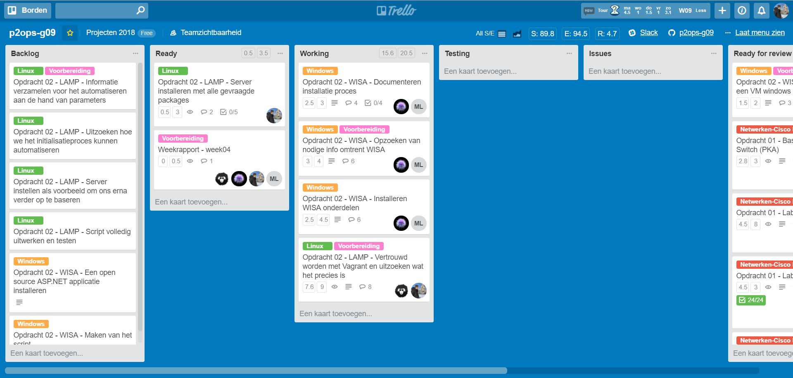

# Voortgangsrapport week 04

* Groep: g09
* Datum: 05/03/2018

| Student          | Aanw. | Opmerking |
| :---             | :---  | :---      |
| Lennert Mertens  |  nvt  |           |
| Maximilian Leire |  nvt  |           |
| Jens Neirynck    |  nvt  |           |
| Kenzie Coddens   |  nvt  |           |

## Wat heb je deze week gerealiseerd?

### Algemeen

[Afbeelding huidige toestand Kanban-bord]

[Afbeelding teamoverzicht tijdregistratie onderverdeeld per deelopdracht]

### Lennert Mertens

* Fysieke opstelling van labo's opdracht 1. Ik heb samen met Kenzie labo 3 en 4 uitgevoerd (werd gecontroleerd)
* Documentatie over labo's aangepast
* Opdracht 2 doorgenomen
* Opdracht 2 overgenomen in Trello en opgedeeld in taken (kaartjes)
* Vertrouwd leren worden met Vagrant (lezen/video's bekijken)
* Documentatie over Vagrant gemaakt
* Weekrapport aangepast en ingevuld

### Jens Neirynck

* Fysieke opstelling van labo's opdracht 1. Ik heb samen met Max labo 1 en 2 uitgevoerd, ook heb ik geholpen met lab 4.
* Opdracht 2 doorgenomen
* Vertrouwd leren worden met Vagrant (lezen/video's bekijken)
* Weekrapport aangepast

### Kenzie Coddens

* Fysieke opstelling van labo 3 samen meet lennert en samen met de groep voor labo 4.
* Opdracht 2 doorgenomen
* Info zoeken over WISA stack
* een clean install van een windows server 2016 standard edition in VB
* Installeren en documenteren van SQL Server 2016 en ASP.NET
* Backlog maken in trello voor WISA stack

### Maximilian Leire

* Fysieke opstelling van labo 4 met Jens.
* Opdracht 3 getest
* Info gezocht over WISA stack
* Trello in orde gemaakt
* Windows server geïnstalleerd

## Wat plan je volgende week te doen?

### Algemeen
### Lennert Mertens
* Script LAMP stack vervolledigen
* Testen met Vagrant
* Aanpassingen maken aan documentatie
* SAP doornemen

### Jens Neirynck
* Voortgang in de lamp stack maken

### Kenzie Coddens
* Afwerken van WISA stack

### Maximilian Leire
* Afwerken installatie WISA stack
* Beginnen met Vagrant

## Waar hebben jullie nog problemen mee?

* Communicatie verloopt nog steeds stroef

## Feedback technisch luik

### Algemeen

WISA:
Goede start van set-ups.
Probeer misschien niet voor elke stap een screenshot toe te voegen. Waar het nodig & moeilijk is, kan dit relevant zijn. Waar er wat eenvoudige stappen genomen worden ("zoals vul deze waarde in in dat veld, en klik op OK") kan er soms beter met tekst gewerkt worden. 
Doel: een betere leesbaarheid van de documenten.

LAMP:
installatieCentOS: wat genoteerd staat, is allemaal triviaal. De screenshots zijn overbodig.
installatieFedoraServer: beter, meer een essentieel overzicht.
Opzetten LAMP op Fedora 27: de issue met de netwerkinstelling hoort thuis in de basis set-up. Idem stuk over netwerk NAT/Bridge.
Vagrant: goede start, maar dit is duidelijk nog een draft.
Algemeen: commando's staan nu als plain text in bullet mode. De lay-out kan beter hiervoor, er is zoals als cmd-style.

### Lennert Mertens 
### Maximilian Leire 
Waarom is er geen tijdsregistratie voor jou aanwezig in week 3? Als team-lid wordt er ook van jouw een bijdrage verwacht. Of liever: zorg dat ze ook zichtbaar is.
Idem vorige week ... 
### Jens Neirynck 
### Kenzie Coddens 

## Feedback analyseluik

### Algemeen

### Lennert Mertens 
### Maximilian Leire 
### Jens Neirynck 
### Kenzie Coddens 

