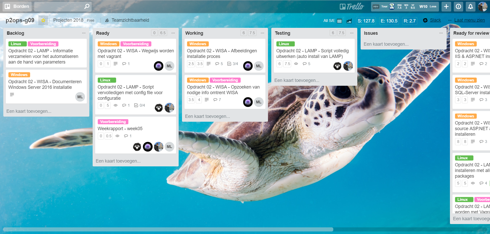
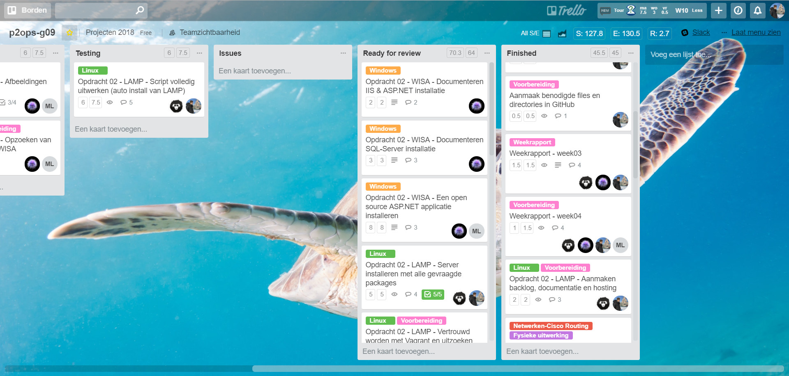
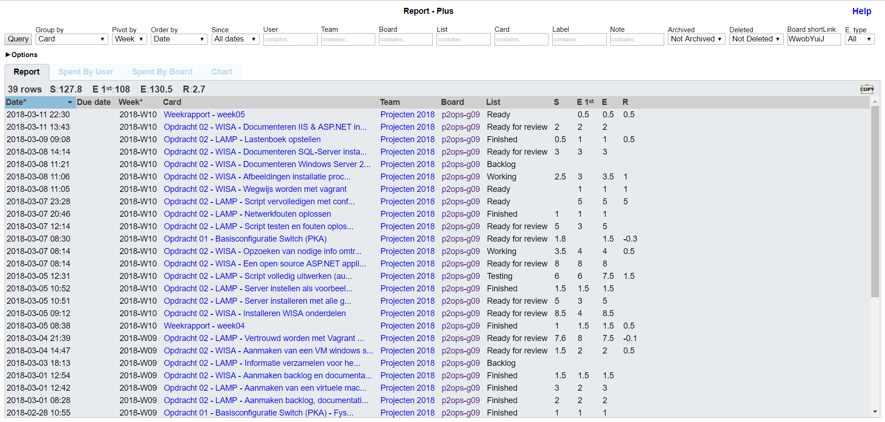
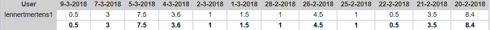
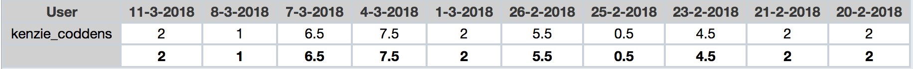
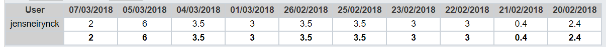
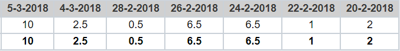

# Voortgangsrapport week 05

* Groep: g09
* Datum: 12/03/2018

| Student          | Aanw. | Opmerking |
| :---             | :---  | :---      |
| Lennert Mertens  |  v    |           |
| Maximilian Leire |  v    |           |
| Jens Neirynck    |  v    |           |
| Kenzie Coddens   |  v    |           |

## Wat heb je deze week gerealiseerd?

### Algemeen

* Volledige LAMP stack opgezet in Fedora + gedocumenteerd
* Script geschreven voor automatisatie van LAMP stack
* LAMP script getest en uitgeprobeerd met Vagrant
* WISA opgezet + gedocumeteerd

[Afbeelding huidige toestand Kanban-bord]

[Afbeelding teamoverzicht tijdregistratie onderverdeeld per deelopdracht]

### Lennert Mertens

* Opzetten LAMP server in Fedora 27 stap per stap (Jens heeft dit gedocumenteerd)
* Script voor automatisering uitgewerkt samen met Jens Neirynck
* Vagrantfile aangepast voor het testen en automatiseren van LAMP server (gelukt)
* Ideeën besproken met Jens voor verbetering van het script (kiezen van parameters voor specifieke keuzes van gebruikers)

[Afbeelding individueel rapport tijdregistratie]

### Kenzie Coddens

* Wisa up and running gekregen.
* getest door een applicatie draaiend te krijgen.
* Wegwijs geworden met vagrant.
* Opzoeken van info omtrent powershellcommandos voor IIS te installeren.
* Documentatie over IIS en ASP.NET gemaalt.
* Documentatie over SQL-Server gemaakt.
* Backlog gemaakt voor een eerste deel.
* Fout meldingen opgelost in verband met windows server.

[Afbeelding individueel rapport tijdregistratie]

### Jens Neirynck

* Documenteren manuele setup Lamp Stack
* Script voor automatisering uitgewerkt samen met Lennert
* Ideeën besproken met voor verbetering van het script (kiezen van parameters voor specifieke keuzes van gebruikers)
* Testen van het script

[Afbeelding individueel rapport tijdregistratie]

### Maximilian Leire

* Trello aangepast 
* ASP.NET Applicatie afgewerkt
* Documentatie Vagrant aangemaakt
* Documentatie ASP.NET applicatie installeren aangemaakt.

## Wat plan je volgende week te doen?

### Algemeen

* Automatisering LAMP volledig afwerken
* Automatisering WISA volledig afwerken  
* Backlog SAP opstellen
* SAP begrijpen en informatie verzamelen

### Lennert Mertens

* Afwerken tot in detail van het LAMP script
* Cofiguratiefile opstellen zodat gebruiker hierin zijn voorkeuren voor gebruikersnaam, wachtwoord, ... kan definiëren
* Vagrantbox volledig testen en bundelen
* Readme schrijven voor informatie over da Vagrantbox (voor de gebruiker oa. hoe de config file gebruiken etc. )
* Opzoeken wat SAP is

### Kenzie Coddens
* Afwerken Wisa
* Scripts werkend krijgen
* Eventuele problemen oplossen
* Nog wat backlog.
* eventueel al helpen met SAP.

### Jens Neirynck
* Script schrijven met parameters
* Script aanpassen installatie wordpress

### Maximilian leire
* Vagrant afwerken

## Waar hebben jullie nog problemen mee?

* Communicatie blijft een zwakte
* Taken worden soms uitgesteld
* Het team dat bezig is met de LAMP weet niet hoe het eraan te gaat bij het team die de WISA maakt en omgekeerd

## Feedback technisch luik

### Algemeen

Als team geven jullie de indruk om goed samen te werken. De vooruitgang die geboekt wordt gaat in de goeie richting.

VM guests: werk steeds met een host-only adapter, niet bridged

LAMP: 
* een link maken tussen wat gespecifieerd staat in vagrant als variabele informatie, en het linux script
* verwijzen naar een externe server moet je wegwerken

WISA:
* eindproduct is een GUI voor de klant
* basis VM is goed opgezet, goed gedocumenteerd ... Maar review zonder testplan kan niet gebeuren

### Lennert Mertens
### Maximilian Leire
### Jens Neirynck
### Kenzie Coddens

## Feedback analyseluik

### Algemeen

### Lennert Mertens
### Maximilian Leire
### Jens Neirynck
### Kenzie Coddens

