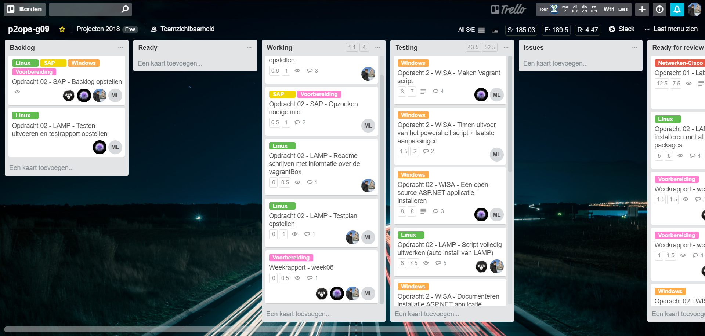
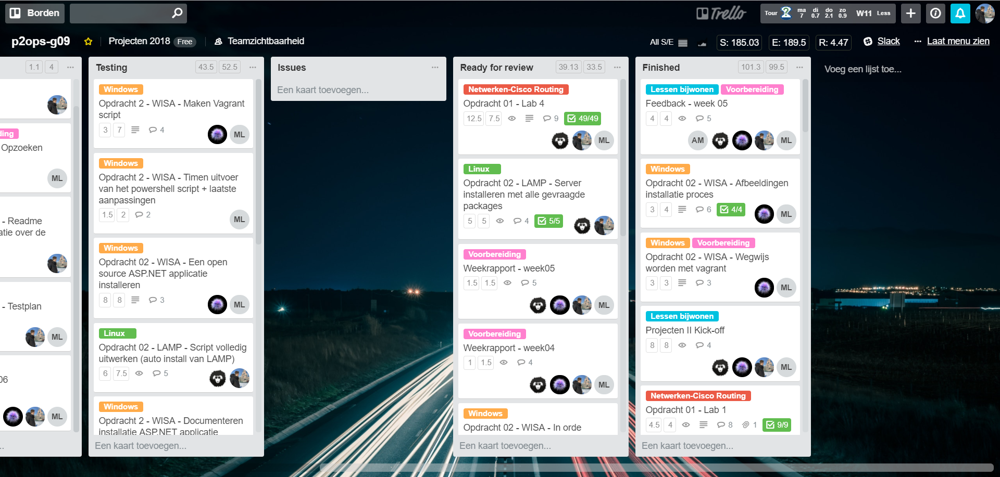
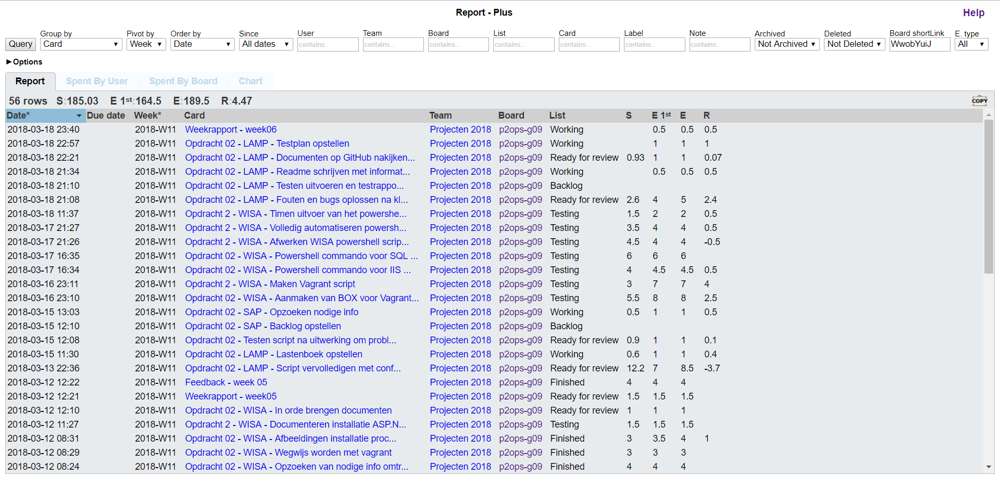
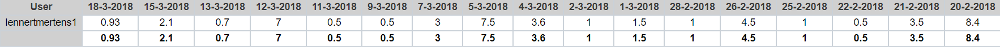
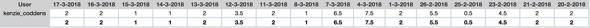

# Voortgangsrapport week 06

* Groep: g09
* Datum: 19/03/2018

| Student          | Aanw. | Opmerking |
| :---             | :---  | :---      |
| Lennert Mertens  |  v    |           |
| Maximilian Leire |  v    |           |
| Jens Neirynck    |  v    |           |
| Kenzie Coddens   |  v    |           |

## Wat heb je deze week gerealiseerd?

### Algemeen

[Afbeelding huidige toestand Kanban-bord]

#### Linux (LAMP)
* LAMP script volledig in orde gebracht
* Problemen opgelost in lampStack.sh
* Uitgezocht hoe configuratie door gebruiker te implementeren in samenwerking met lampStack.sh
* Alles laten samenwerken 
* LAMP opdracht afgewerkt

#### Windows (WISA)

* info op gezocht over unattended install van IIS-Manager en SQL-Server
* Vagrant file gemaakt.
* Maken van een custom vagrant box naar onze eisen.
* testen van alle powershell stukken afzonderlijk.
* Alles samen gevoegd in 1 groot powershell script met variabelen.

[Afbeelding teamoverzicht tijdregistratie onderverdeeld per deelopdracht]

### Lennert Mertens

* Fouten in lampStack.sh opgelost
* configuratiefile geschreven en op punt gezet
* Vagrantfile volledig op punt gezet
* Kleine functionele testen uitgevoerd
* Parameters in script aangepast om functionaliteit met andere waarden te testen
* Readme geschreven met uitleg over werking vagrant box
* Start tesplan geschreven
* GitHub opgekuist en nagekeken
* Template weekrapport in orde gebracht
* Weekrapport aangevuld

[Afbeelding individueel rapport tijdregistratie]

### Kenzie Coddens

* Vagrant script geholpen.
* opzoeken info unattended install sql server.
* opzoeken info unattended install iis-manager.
* uit proberen verschillende manieren install sql server.
* uit proberen server role install.
* maken mogelijk powershell script.
* info gebundeld.

[Afbeelding individueel rapport tijdregistratie]

### Maximilian Leire

* ASP.NET-applicatie handmatig installeren
* Maken vagrant box met Packer
* Maken powershell script voor setup van de server

[Afbeelding individueel rapport tijdregistratie]

### Jens Neirynck

* Fouten in lampStack.sh opgelost
* Vagrantfile volledig werkend gemaakt
* vagrantConfig geschreven
* Testen uitgevoerd
* Parameters in script aangepast

[Afbeelding individueel rapport tijdregistratie]

## Wat plan je volgende week te doen?
### Algemeen
* Testen LAMP
* Testen WISA
* Indienen Opracht LAMP
* Indienen Opdracht WISA
* SAP opdracht uitvoeren

### Lennert Mertens
* Uitzoeken wat SAP is
* Opdracht SAP uitvoeren
* Testen WISA
* Testplan WISA helpen opstellen

### Kenzie Coddens
* Testen LAMP
* SAP info
* SAP uitvoeren
* Testplan/Rapport LAMP
### Maximilian
* Testen van de LAMP stack
* Opzoeken info omtrent SAP
* Maken SAP
### Student 4

## Waar hebben jullie nog problemen mee?

* Nog steeds te weinig kennis van wat het andere 'team' uitvoert
* Er wordt pas echt veel tegen het einde van de week gewerkt (niet echt en probleem maar kan gevaarlijk zijn als dingen niet lukken)

## Feedback technisch luik

Technisch goede vooruitgang in dit team. 

+: Jullie structuur is goed georganiseerd op GitHUB
-: SAP uitstellen tot de laatste week was misschien niet het beste idee

Lamp: goed script, duidelijk opgebouwd. Werkpunten: iets meer commentaar + ev. checks over of iets al gebeurd is of niet 

Documentatie: individueel goede documenten, verwijzingen naar de docs onderling mogen beter.

Testplan: relevante bullets, maar waar je ze moet nagaan kan gespecifieerd worden.

### Algemeen

### Lennert Mertens
### Maximilian Leire
### Jens Neirynck
### Kenzie Coddens

## Feedback analyseluik

### Algemeen

### Lennert Mertens
### Maximilian Leire
### Jens Neirynck
### Kenzie Coddens

