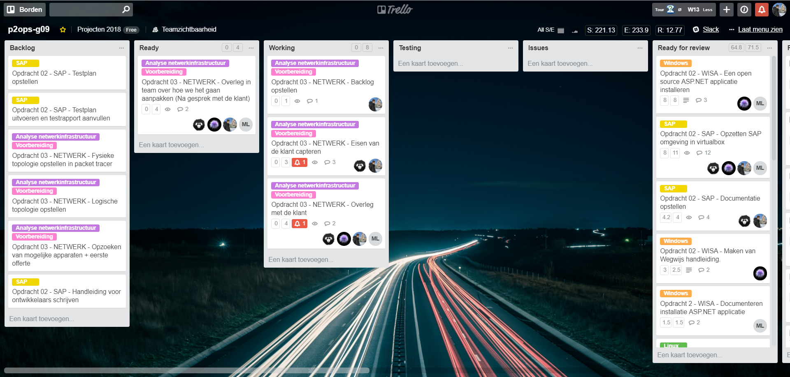
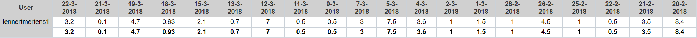

# Voortgangsrapport week 07

* Groep: g09
* Datum:

| Student          | Aanw. | Opmerking |
| :---             | :---  | :---      |
| Lennert Mertens  |  v    |           |
| Maximilian Leire | v     |           |
| Jens Neirynck    |  v    |           |
| Kenzie Coddens   |  v    |           |

## Wat heb je deze week gerealiseerd?

### Algemeen

[Afbeelding huidige toestand Kanban-bord]

* LAMP Afgewerkt
* SAP Afgewerkt
* WISA Afgewerkt
* Backlog Opdracht 03 aangemaakt
* Opdracht 03 overlopen en afgesproken hoe we het gaan aanpakken

[Afbeelding teamoverzicht tijdregistratie onderverdeeld per deelopdracht]

### Lennert Mertens

* Geholpen bij installatie SAP
* Documentatie SAP geschreven
* LAMP testen overlopen samen met Maximilian
* WISA testen doorlopen samen met Jens

[Afbeelding individueel rapport tijdregistratie]

### Kenzie Coddens

* Verder WISA afgewerkt
* Problemen met SSMS opgelost
* Problemen met auto install opgelost
* Uitbundige debugging
* Helpen opzoeken SAP omgeving
* Helpen opstellen documetatie SAP omgeving
* Teten van SAP omgeving
* Schrijven van testrapport en testplan.
* Problemen vastgesteld in WISA testrapport opgelost.
* Handleiding gemaakt voor WISA.
* Documentatie geupdated voor WISA.

[Afbeelding individueel rapport tijdregistratie]

### Jens Neirynck

* Installatie SAP gedaan
* Fouten ivm SAP oplossen
* WISA testen + testrapport en testplan opzetten

[Afbeelding individueel rapport tijdregistratie]

### Maximilian Leire

* Testen LAMP
* Afwerk WISA

[Afbeelding individueel rapport tijdregistratie]

## Wat plan je volgende week te doen?

### Algemeen
* Overleggen met de klant opracht 03
* Packet tracer opstellingen opdracht 3 maken
* Verslagen schrijven
* Eisen capteren
* Apparatuur opzoeken
### Lennert Mertens
* Packet tracer opstellingen opdracht 3 maken
* Documenteren
* Afspreken met de klant
### Kenzie Coddens
* Packet tracer helpen opstellen.
* Verslagen maken van vergaderingen.
* Bijlage toevoegen.
* Verder afwerken opdracht03
### Jens Neirynck
* Packet tracer topologiën
* Documenteren
* Afspreken met de klant
### Maximilian Leire
* Afwezig

## Waar hebben jullie nog problemen mee?

* ...
* ...

## Feedback technisch luik

### Algemeen

Als groep zijn jullie resultaten erg goed. Op dit moment mag jullie werk gezien zijn.
De structuur van de documentatie en scripts is erg goed afgewerkt op GIThub.

#### LAMP
Afgewerkte installtie & goedgekeurd.
Goed gestructureerd testplan, soms iets te veel details om na te kijken (maar niet storend).
Enigste tekort: een "finale test", een PHP script dat iets schrijft in de database ontbreekt.
Opmerking: een zin "nog verder aan te vullen" dient hier niet meer in voor te komen. Moet je nog opruimen

#### WISA
Technische verificate van vagrant installatie werkt. Goegekeurd.
Documentatie van handleiding en testplan zijn niet volledig afgewerkt, de tijd hiervoor werd onderschat.
Hiervoor wordt een deadline extension goedgekeurd. 

#### SAP
+ Docmentatie is uitgebreid omdat de automatisering niet goed lukt
- Lastenboek ontbreekt
Status: de installatie in zijn basis in orde. 
Het testplan is niet voldoende uitgewerkt, studenten wachten op informatie uit een ander vak.
Deze deadline wordt uitgesteld naar een later moment.

### Lennert Mertens
### Maximilian Leire
### Jens Neirynck
### Kenzie Coddens

## Feedback analyseluik

### Algemeen

### Lennert Mertens
### Maximilian Leire
### Jens Neirynck
### Kenzie Coddens

