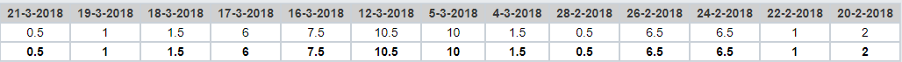

# Voortgangsrapport week 08

* Groep: g09
* Datum: 16/04/2018

| Student          | Aanw. | Opmerking |
| :---             | :---  | :---      |
| Lennert Mertens  |       |           |
| Maximilian Leire |Afwezig|Gewettigd op ibamaflex|
| Jens Neirynck    |       |           |
| Kenzie Coddens   |       |           |

## Wat heb je deze week gerealiseerd?

### Algemeen
[Afbeelding huidige toestand Kanban-bord]

- Overleg gepleegd over hoe we komende week alles gaan aanpakken
- Laatste onderhandelingen met studenten vastgoed
- Alle gesprekken met de groepen vastgoed afgewerkt
- Noden van de studenten gecapteerd

### Lennert Mertens

* Github onderhoud
* Gesprek met studenten vastgoed
* Contactmomenten geregeld
* Eisen gecapteerd

[Afbeelding individueel rapport tijdregistratie]

### Kenzie Coddens

* Gesprekken met studenten vastgoed.
* Eisen helpen capteren.

[Afbeelding individueel rapport tijdregistratie]

### Maximilian Leire

* Eisen gecapteerd
* Beginnen opstelling packet tracer

[Afbeelding individueel rapport tijdregistratie]

### Jens Neirynck
 
* Gesprek met studenten vastgoed
* Eisen gecapteerd
* Starten proof of concept in packet tracer

[Afbeelding individueel rapport tijdregistratie]

## Wat plan je volgende week te doen?

### Algemeen
- Packet tracer opstelling voor alle groepen
- Facturen voor alle groepen
- Documentatie en presentaties voor alle groepen
### Lennert Mertens
- Packet tracer opstelling groep 19
- 2 Facturen voor groep 19
- Documentatie groep 19
- Presentatie groep 19

### Maximilian Leire
- Packet tracer opstelling groep 25
- 2 Facturen voor groep 25
- Presentatie groep 25
### Jens Neirynck
### Kenzie Coddens
- Packet tracer maken
- Proof of concept
- Verslag maken.

## Waar hebben jullie nog problemen mee?

* Te weinig gedaan in de vakantie 

## Feedback technisch luik

### Algemeen

WISA: testrapport verbeterd, detailopmerking: auteurs idem in zowel plan als rapport. Niet aangepast.

merge probleem week08.md - individuele rapporten

Eerste overleg heeft plaatsgevonden. Nog één groep ontbreekt qua verslag, nog niet genoeg informatie ontvangen.
Groep19 en 29 zijn in orde.

Basis in PT uitgewerkt over het netwerk, dus dit is in goede voortgang.

### Lennert Mertens
### Maximilian Leire
### Jens Neirynck
### Kenzie Coddens

## Feedback analyseluik

### Algemeen

### Lennert Mertens
### Maximilian Leire
### Jens Neirynck
### Kenzie Coddens

