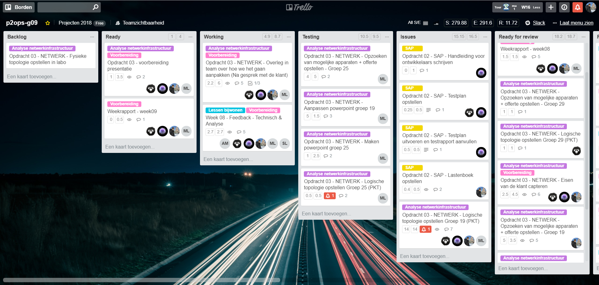
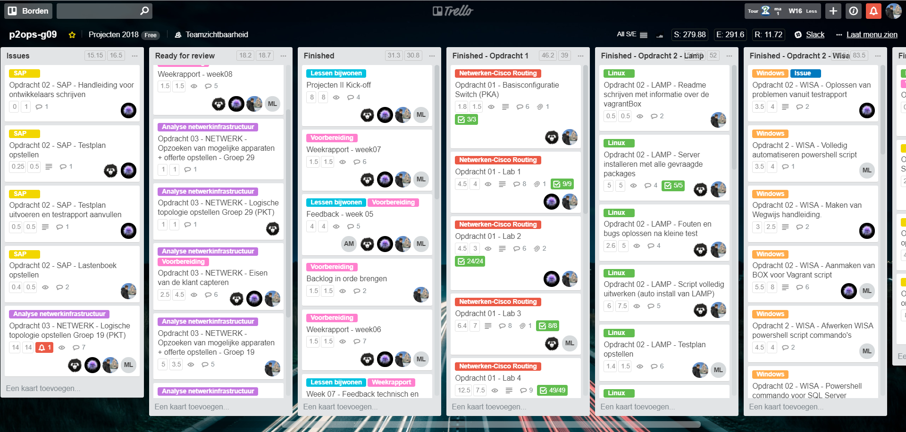
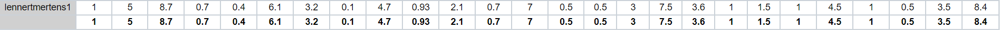
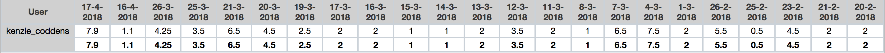
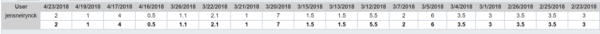
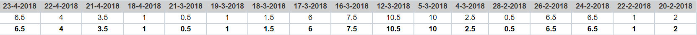

# Voortgangsrapport week 09

* Groep: g09
* Datum: 23/04/2018

| Student          | Aanw. | Opmerking |
| :---             | :---  | :---      |
| Lennert Mertens  |  v    |           |
| Maximilian Leire |  v    |           |
| Jens Neirynck    |  v    |           |
| Kenzie Coddens   |  v    |           |

## Wat heb je deze week gerealiseerd?

### Algemeen

- Packet tracer opstellingen 
- Offertes
- Brochures
- Presentaties

[Afbeelding huidige toestand Kanban-bord]

[Afbeelding teamoverzicht tijdregistratie onderverdeeld per deelopdracht]

### Lennert Mertens

* Offertes G19
* Brochures G19
* Presentatie G19
* Test packet tracer G19

[Afbeelding individueel rapport tijdregistratie]

### Kenzie Coddens

* Meest complexe pakket tracer uitgewerkt
* Problemen opgelost in pakket tracer
* Document gemaakt met pakket tracer code voorbeeld/template

[Afbeelding individueel rapport tijdregistratie]

### Jens Neirynck

* Offertes G29
* Catalogus geschreven voor groep 29
* Presentatie van groep 29
* Packet tracer opstelling G29

[Afbeelding individueel rapport tijdregistratie]

### Maximilian Leire

* Helpen maken packet tracer groep 19 & 25
* Maken powerpoint groep 19 & 25
* Catalogus & offerte groep 25

[Afbeelding individueel rapport tijdregistratie]

## Wat plan je volgende week te doen?

### Algemeen
- SAP hosten
- Alle openstaande zaken afwerken
### Lennert Mertens
### Maximilian Leire
* SAP afwerken
### Jens Neirynck
* SAP hosten
### Kenzie Coddens
* helpen waar nodig
* helpen pakket tracer debuggen.

## Waar hebben jullie nog problemen mee?

* ...
* ...

## Feedback technisch luik

### Algemeen

De technische toelichting was bij momenten te veel in detail; klantgerichte zaken (zoals het opzetten van een hotspot met de smartphone) waren keuzes die va nbelang waren, maar niet toegelicht werden. 

### Lennert Mertens
### Maximilian Leire
### Jens Neirynck
### Kenzie Coddens

## Feedback analyseluik

### Algemeen

Twee offertes zijn goed uitgewerkt, maar dit moest je eigenlijk ook in je presentatie opgenomen hebben. De prijs doet er toe voor de klant. 

### Lennert Mertens
### Maximilian Leire
### Jens Neirynck
### Kenzie Coddens

