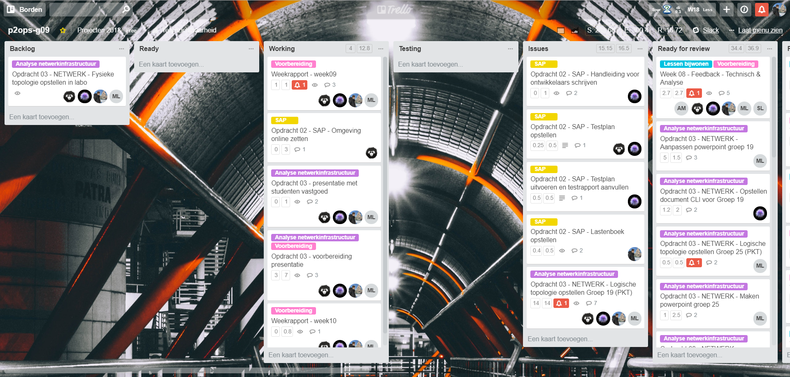
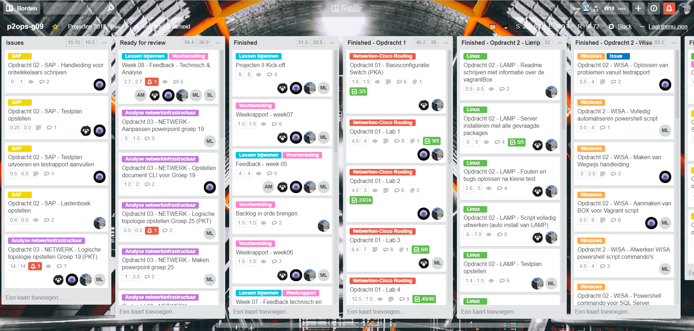
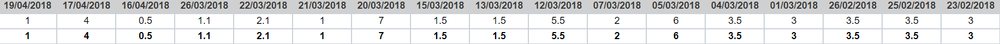
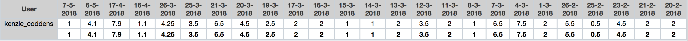
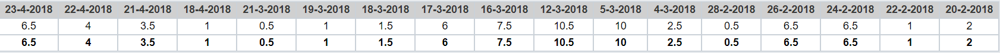

# Voortgangsrapport week 10

* Groep: g09
* Datum: 30/04/2018 - verlofdag

| Student          | Aanw. | Opmerking |
| :---             | :---  | :---      |
| Lennert Mertens  |       |           |
| Maximilian Leire |       |           |
| Jens Neirynck    |       |           |
| Kenzie Coddens   |       |           |

## Wat heb je deze week gerealiseerd?

### Algemeen

[Afbeelding huidige toestand Kanban-bord]

* Presentatie met groepen vastgoed
* Vragenronde met groepen vastgoed
* Tussentijdse bespreking
* Taakverdeling
* Backlog in orde brengen

[Afbeelding teamoverzicht tijdregistratie onderverdeeld per deelopdracht]

### Lennert Mertens

* Offerte aangepast voor groep 19 (op hun aanvraag achteraf)
* Backlog in orde gebracht
* Weekrapport in opgesteld

[Afbeelding individueel rapport tijdregistratie]

### Jens Neirynck

* Uitwerken opdracht SAP

[Afbeelding individueel rapport tijdregistratie]

### Kenzie Coddens

* Presentatie voor groep vastgoed
* pkt concept verder uitwerken

[Afbeelding individueel rapport tijdregistratie]

### Maximilian Leire

* Afwerken opstelling packet tracer

[Afbeelding individueel rapport tijdregistratie]

## Wat plan je volgende week te doen?

### Algemeen
* Proof of concept (vastgoed)
* SAP gebruikershandleiding
* Online plaatsen SAP omgeving
* MDT uitrollen
* MDT Testen (testplan - rapport schrijven)
* MDT Documentatie schrijven
### Lennert Mertens
* MDT uitrollen
### Maximilian Leire
* Proof of concept afwerken
* SAP afwerken
### Jens Neirynck
* MDT uitrollen
### Kenzie Coddens
* proof of concept
* SAP handleiding

## Waar hebben jullie nog problemen mee?

* weinig communicatie nu wegens drukke periode met andere projecten, dit zal er voor zorgen dat er meer werk naar de volgende week zal worden verplaatst.

## Feedback technisch luik

### Algemeen

### Lennert Mertens
### Maximilian Leire
### Jens Neirynck
### Kenzie Coddens

## Feedback analyseluik

### Algemeen

### Lennert Mertens
### Maximilian Leire
### Jens Neirynck
### Kenzie Coddens

