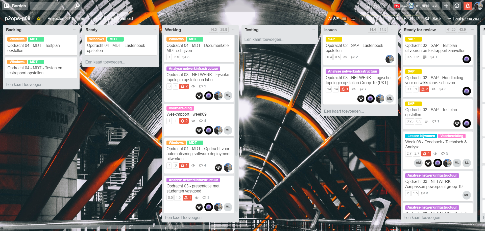
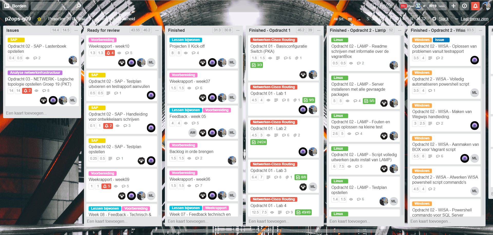
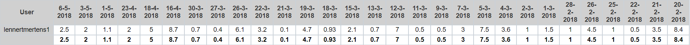
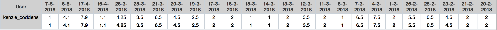
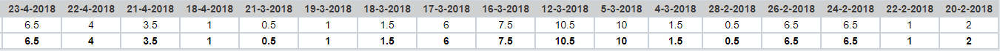

# Voortgangsrapport week 11

* Groep: g09
* Datum: 07/05/2018

| Student          | Aanw. | Opmerking |
| :---             | :---  | :---      |
| Lennert Mertens  |  v    |           |
| Maximilian Leire |  v    |           |
| Jens Neirynck    |  v    |           |
| Kenzie Coddens   |  v    |           |

## Wat heb je deze week gerealiseerd?

### Algemeen

[Afbeelding huidige toestand Kanban-bord]

* Windows Deployment Tool Kit (vertrouwd raken)
* LAMP online geplaatst
* Packet Tracer vastgoed

[Afbeelding teamoverzicht tijdregistratie onderverdeeld per deelopdracht]

### Lennert Mertens

* Windows Deployment Tool Kit (vertrouwd raken)
* Documentatie aanvullen
* Lastenboek opstellen

[Afbeelding individueel rapport tijdregistratie]

### Jens Neirynck

* Starten installatie WDT
* Online zetten webapplicatie LAMP

[Afbeelding individueel rapport tijdregistratie]

### Kenzie Coddens

* Handleiding SAP gevonden
* Verder proberen oplossen van probleem pkt

[Afbeelding individueel rapport tijdregistratie]

### Maximilian Leire

* Oplossen problemen packet tracer

[Afbeelding individueel rapport tijdregistratie]

## Wat plan je volgende week te doen?

### Algemeen
### Lennert Mertens
* MDTK documentatie en installatie
* Lastenboek afwerken
* Proof of concept
* Testplan opstellen voor MDTK
### Jens Neirynck
* MDTK documentatie en installatie
* Proof of concept
* Testplan opstellen voor MDTK
### Kenzie Coddens
* proof of concept
### Maximilian Leire
* proof of concept opstellen
* Maken individuele packet tracer
## Waar hebben jullie nog problemen mee?

* ...
* ...

## Feedback technisch luik

### Algemeen

Opdracht2:
* LAMP: demonstratie van werkende server op Digital Ocean, sql+drupal. Afgerond en in orde.
* SAP: geen echte handleiding voor de gebruiker, enkel een referentie naar de SAP manual online van de ontwikkelaar.
Verwacht: concrete stappen om met jullie opgezette systeem te kunnen verbinden, en aan de slag te gaan.
Dit staat in documentatie. De begrippen werden verward.

Opdracht3: 
* presentatie goed voorbereid, nagekeken taken voorbereiding presentatie
* PT moet nog nagekeken worden

Opdracht4: 
* ISO wordt getest, werkt nog niet. Hint: welk pad probeert de ISO file te zoeken "by default"? 

NAT tijdens de les: afgewerkt in zijn basisvorming, na enige hints van de tutors.

### Lennert Mertens
### Maximilian Leire
Het bijwerken van weekrapporten dient door iedereen op conscensieuze wijze te gebeuren, ook als je er een dag niet bent.

### Jens Neirynck
### Kenzie Coddens

## Feedback analyseluik

### Algemeen

### Lennert Mertens
### Maximilian Leire
### Jens Neirynck
### Kenzie Coddens

