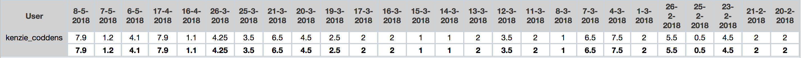

# Voortgangsrapport week 12

* Groep: g09
* Datum: 14/05/2018

| Student          | Aanw. | Opmerking |
| :---             | :---  | :---      |
| Lennert Mertens  |  v    |           |
| Maximilian Leire |  x    | te laat   |
| Jens Neirynck    |  v    |           |
| Kenzie Coddens   |  v    |           |

## Wat heb je deze week gerealiseerd?

### Algemeen

[Afbeelding huidige toestand Kanban-bord]

* Proof of concept vastgoed
* Packet tracers aangepast 
* Deel MDTK
* Overleg over einde van projecten

### Lennert Mertens

* Deel MDTK opdracht

[Afbeelding individueel rapport tijdregistratie]

### Kenzie Coddens

* tying up the loose ends
* Laatste aanpassing door gevoerd aan packet tracers
* Documentatie packet tracer aangepast
* Alle lastenboeken aangevuld met mijn gegevens

[Afbeelding individueel rapport tijdregistratie]

### Jens Neirynck

* Deel MDTK opdracht

[Afbeelding individueel rapport tijdregistratie]

[Afbeelding individueel rapport tijdregistratie]

### Maximilian Leire

* Oplossen packet tracer probleem
* Opstellen proof of concept
* Afwerken packet tracer groep 25

[Afbeelding individueel rapport tijdregistratie]

## Wat plan je volgende week te doen?

### Algemeen
- Afwerken opdracht 4
- Github in orde zetten 
- Alles controleren
- Projecten II afsluiten met een (hopelijk) goede evaluatie ;-) 
### Lennert Mertens
### Maximilian Leire
### Jens Neirynck
### Kenzie Coddens
* Testen van WDT met max

## Waar hebben jullie nog problemen mee?

* Weekrapporten die niet ingevuld raken
* Lastenboeken die eveneens niet allemaal zijn aangevuld

## Feedback technisch luik

### Algemeen

03.PT: erg goed gedocumenteerde stappen over hoe de Packet Tracer werd opgesteld, hier zijn jullie verder gegaan als wat standaard is.

04.MDT: de grote zoektocht naar de juiste CLI opties was de grootste uitdaging. 
Alle documentatie is goed afgewerkt, behalve de handleiding over hoe je via F12 de pxe-boot opstart, en welke stappen je dan moet doorlopen. De laatste week :) ... 

De opdracht werd correct gedemonstreerd. Goede afwerking van alle opdrachten, het siert deze groep.

### Lennert Mertens
### Maximilian Leire

Je eerder latente houding t.o.v. weekrapporten trekt zich door naar een afwezigheid, dit wordt helemaal niet geapprecieerd.

### Jens Neirynck
### Kenzie Coddens

## Feedback analyseluik

### Algemeen

### Lennert Mertens
### Maximilian Leire
### Jens Neirynck
### Kenzie Coddens

